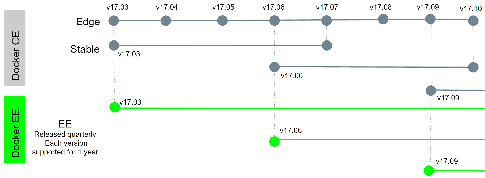

<!-- START doctoc generated TOC please keep comment here to allow auto update -->
<!-- DON'T EDIT THIS SECTION, INSTEAD RE-RUN doctoc TO UPDATE -->
**Table of Contents**  *generated with [DocToc](https://github.com/thlorenz/doctoc)*

- [Introduction to Docker and Kubernetes](#introduction-to-docker-and-kubernetes)
  - [Installing Docker: The Fast Way](#installing-docker-the-fast-way)
    - [Installing on Windows 10 (Pro or Enterprise)](#installing-on-windows-10-pro-or-enterprise)
    - [Installing on Windows 7, 8, or 10 Home Edition](#installing-on-windows-7-8-or-10-home-edition)
      - [Important links for Windows](#important-links-for-windows)
    - [Installing on Mac](#installing-on-mac)
      - [Important Links for Mac](#important-links-for-mac)
    - [Installing on Linux](#installing-on-linux)
    - [Terminal Shell and Tab Completion for Docker CLI](#terminal-shell-and-tab-completion-for-docker-cli)
      - [Windows PowerShell Tab Completion](#windows-powershell-tab-completion)
      - [macOS Terminals](#macos-terminals)
      - [macOS Bash Tab Completion](#macos-bash-tab-completion)
      - [Linux](#linux)
    - [What if None Of These Options Work](#what-if-none-of-these-options-work)
  - [Docker Version Format Change](#docker-version-format-change)
  - [Creating and using containers](#creating-and-using-containers)
    - [Docker install and Config](#docker-install-and-config)
    - [Starting a Nginx web server](#starting-a-nginx-web-server)
      - [Image vs container](#image-vs-container)
      - [What happens when we run a container?](#what-happens-when-we-run-a-container)
    - [Container Vs Virtual Machine](#container-vs-virtual-machine)
    - [Assignment: Manage Multiple Containers](#assignment-manage-multiple-containers)
      - [Solution](#solution)
    - [What's Going on in containers: CLI Process Monitoring](#whats-going-on-in-containers-cli-process-monitoring)
    - [Getting a Shell inside containers: No Need for SSH](#getting-a-shell-inside-containers-no-need-for-ssh)
    - [Docker Networks: Concepts](#docker-networks-concepts)
      - [Docker Networks Defaults](#docker-networks-defaults)
      - [Docker Networks: CLI Management](#docker-networks-cli-management)
      - [Docker Networks: DNS](#docker-networks-dns)
    - [Assignment: Using Containers for CLI Testing.](#assignment-using-containers-for-cli-testing)
      - [Solution](#solution-1)
    - [Bug in alpine affects nslookup](#bug-in-alpine-affects-nslookup)
    - [Assignment: DNS Round Robin Testing](#assignment-dns-round-robin-testing)
      - [Solution](#solution-2)
  - [Container Images: Where to find them and how to build them](#container-images-where-to-find-them-and-how-to-build-them)
    - [What's  In  An Image and What Isn't](#whats--in--an-image-and-what-isnt)
    - [Image Creation  and Storage](#image-creation--and-storage)
    - [Image Highlights](#image-highlights)
    - [Image and Their Layers](#image-and-their-layers)
    - [Image Tagging and Pushing to Docker Hub](#image-tagging-and-pushing-to-docker-hub)
    - [Building Images: The Dockerfile Basics](#building-images-the-dockerfile-basics)
    - [Building Images: Running Docker builds](#building-images-running-docker-builds)
    - [Building IMages: Extending Official Images](#building-images-extending-official-images)
    - [Assignment: Build your own Dockerfile and Run containers From it](#assignment-build-your-own-dockerfile-and-run-containers-from-it)
      - [Solution:](#solution)
    - [Using Prune to Keep Your Docker System Clean (YouTube)](#using-prune-to-keep-your-docker-system-clean-youtube)
  - [Container Lifetime and Persistent Data: Volumes](#container-lifetime-and-persistent-data-volumes)
    - [Persistent Data: Data Volumes](#persistent-data-data-volumes)
    - [Shell Differences for Path Expansion](#shell-differences-for-path-expansion)
    - [Persistent Data: Bind Mounting](#persistent-data-bind-mounting)
  - [Making it easier with docker-compose.yml file](#making-it-easier-with-docker-composeyml-file)
    - [Docker-compose.yml](#docker-composeyml)
    - [Docker-compose CLI](#docker-compose-cli)
    - [Assignment: Writing a Compose File](#assignment-writing-a-compose-file)
      - [Solution:](#solution-1)
    - [Assignment: Compose For On-The-Fly Image Building and Multi-Container Testing](#assignment-compose-for-on-the-fly-image-building-and-multi-container-testing)
  - [Dockerfile](#dockerfile)
  - [Compose File](#compose-file)
  - [Start Containers, Configure Drupal](#start-containers-configure-drupal)
      - [Solution:](#solution-2)
  - [Container Registries: Image Storage and Distribution](#container-registries-image-storage-and-distribution)
    - [Docker  Hub:  Digging Deeper](#docker--hub--digging-deeper)
    - [Run a Private Docker Registry](#run-a-private-docker-registry)
    - [Important Links:](#important-links)
    - [Third Party Image Registries](#third-party-image-registries)
  - [Introduction to Kubernetes](#introduction-to-kubernetes)
  - [Kubernetes design principles](#kubernetes-design-principles)
  - [What are the components of a Kubernetes cluster?](#what-are-the-components-of-a-kubernetes-cluster)
  - [What happens in the Kubernetes control plane?](#what-happens-in-the-kubernetes-control-plane)
    - [Control plane](#control-plane)
    - [kube-apiserver](#kube-apiserver)
    - [kube-scheduler](#kube-scheduler)
    - [kube-controller-manager](#kube-controller-manager)
    - [etcd](#etcd)
  - [What happens in a Kubernetes node?](#what-happens-in-a-kubernetes-node)
    - [Nodes](#nodes)
    - [Pods](#pods)
    - [Container runtime engine](#container-runtime-engine)
    - [kubelet](#kubelet)
    - [kube-proxy](#kube-proxy)
  - [What else does a Kubernetes cluster need?](#what-else-does-a-kubernetes-cluster-need)
    - [Persistent storage](#persistent-storage)
    - [Container registry](#container-registry)
    - [Underlying infrastructure](#underlying-infrastructure)
  - [Kubernetes Install and running the first POD](#kubernetes-install-and-running-the-first-pod)
    - [Kubernetes Local Install](#kubernetes-local-install)
    - [minikube](#minikube)
  - [Kubectl run, create and apply](#kubectl-run-create-and-apply)
  - [Our First Pod With Kubectl run](#our-first-pod-with-kubectl-run)
  - [Scaling ReplicaSets](#scaling-replicasets)
  - [Inspecting Kubernetes Objects](#inspecting-kubernetes-objects)
  - [Exposing Kubernetes Ports](#exposing-kubernetes-ports)
    - [Service Types](#service-types)
    - [Creating a ClusterIP Service](#creating-a-clusterip-service)
    - [Creating a NodePort and LoadBalancer Service](#creating-a-nodeport-and-loadbalancer-service)
    - [Kubernetes Services DNS](#kubernetes-services-dns)
  - [Kubernetes Management Techniques](#kubernetes-management-techniques)
    - [Run, Expose and Create Generators](#run-expose-and-create-generators)
    - [The Future of Kubectl Run](#the-future-of-kubectl-run)
    - [Imperative vs. Declarative](#imperative-vs-declarative)
  - [Moving to Declarative Kubernetes YAML](#moving-to-declarative-kubernetes-yaml)
    - [Kubectl Apply](#kubectl-apply)
    - [Building Your YAML Files](#building-your-yaml-files)
    - [Dry Runs and Diffs](#dry-runs-and-diffs)
    - [Labels and Label Selectors](#labels-and-label-selectors)
  - [EKS CLUSTER CREATION WORKFLOW](#eks-cluster-creation-workflow)
- [Getting Started](#getting-started)
  - [Create an AWS Account](#create-an-aws-account)
  - [Create a Workspace](#create-a-workspace)
  - [Install Kubernetes Tools](#install-kubernetes-tools)
  - [Create an IAM role for your Workspace](#create-an-iam-role-for-your-workspace)
  - [Attach the IAM role to your Workspace](#attach-the-iam-role-to-your-workspace)
  - [Update IAM Settings for your Workspace](#update-iam-settings-for-your-workspace)
  - [Clone the service repos](#clone-the-service-repos)
  - [Create an AWS KMS Customer Managed Key](#create-an-aws-kms-customer-managed-key)
- [Launch Using EKSCTL](#launch-using-eksctl)
  - [Prerequisites](#prerequisites)
  - [Launch EKS](#launch-eks)
    - [Create an EKS Cluster](#create-an-eks-cluster)
  - [Test the Cluster](#test-the-cluster)
- [Helm](#helm)
  - [Introduction](#introduction)
  - [Install Helm CLI](#install-helm-cli)
  - [Deploy nginx with Helm](#deploy-nginx-with-helm)
    - [Update the Chart repository](#update-the-chart-repository)
    - [Search Chart repositories](#search-chart-repositories)
    - [Add the Bitnami Repository](#add-the-bitnami-repository)
    - [Install bitname/nginx](#install-bitnamenginx)
    - [cleanup](#cleanup)
- [Autoscaling our Applications and Cluster](#autoscaling-our-applications-and-cluster)
  - [Install kube-ops-view](#install-kube-ops-view)
  - [Configure Horizontal Pod Autoscaler (HPA)](#configure-horizontal-pod-autoscaler-hpa)
    - [Deploy the Metrics Server](#deploy-the-metrics-server)
  - [Scale an application with HPA](#scale-an-application-with-hpa)
    - [Deploy a Sample App](#deploy-a-sample-app)
    - [Create an HPA resource](#create-an-hpa-resource)
    - [Generate load to trigger scaling](#generate-load-to-trigger-scaling)
  - [Configure Cluster Autoscaler (CA)](#configure-cluster-autoscaler-ca)
    - [Configure the ASG](#configure-the-asg)
    - [IAM roles for service accounts](#iam-roles-for-service-accounts)
    - [Deploy the Cluster Autoscaler (CA)](#deploy-the-cluster-autoscaler-ca)
  - [Scale a cluster with CA](#scale-a-cluster-with-ca)
    - [Deploy a Sample App](#deploy-a-sample-app-1)
    - [Scale our ReplicaSet](#scale-our-replicaset)
  - [cleanup](#cleanup-1)

<!-- END doctoc generated TOC please keep comment here to allow auto update -->

# Introduction to Docker and Kubernetes
## Installing Docker: The Fast Way
If you don't already have docker installed, Docker already has some great guides on how to do it. The rest of this Section is about how to setup Docker on your specific OS, but if you already know which OS you want to install on, here's the short-list for downloading it. The videos after this Lecture are walkthroughs of installing Docker, getting the GitHub repo, getting a code editor, and tweaking the command line if you want to. Feel free to skip any and all of this if you have at least docker version 17.06 and like your current setup :)

### Installing on Windows 10 (Pro or Enterprise)

This is the best experience on Windows, but due to OS feature requirements, it only works on the Pro and Enterprise editions of Windows 10 (with latest update rollups). You need to install "Docker for Windows" from the Docker Store.

With this Edition I recommend using PowerShell for the best CLI experience. See more info in the next few Lectures.

### Installing on Windows 7, 8, or 10 Home Edition

Unfortunately, Microsoft's OS features for Docker and Hyper-V don't work in these older versions, and "Windows 10 Home" edition doesn't have Hyper-V, so you'll need to install the Docker Toolbox, which is a slightly different approach to using Docker with a VirtualBox VM. This means Docker will be running in a Virtual Machine that sits behind the IP of your OS, and uses NAT to access the internet.

NOTE FOR TOOLBOX USERS: For all examples that use http://localhost , you'll need to replace with http://192.168.99.100

#### Important links for Windows
- [Install Docker Desktop on Windows](https://docs.docker.com/desktop/windows/install/)
- [Docker Hub](https://hub.docker.com/)
- [Github Desktop](https://desktop.github.com/)
- [VS Code](https://code.visualstudio.com/)
- [cmder](https://cmder.net/)
- [Docker for Windows FAQ](https://docs.docker.com/desktop/faqs/)
- [DockerCompletion](https://github.com/matt9ucci/DockerCompletion)
- [Getting Started](https://docs.docker.com/desktop/windows/)
### Installing on Mac

You'll want to install Docker for Mac, which is great. If you're on an older Mac with less than OSX Yosemite 10.10.3, you'll need to install the Docker Toolbox instead.

#### Important Links for Mac
- [Download and Insall Docker](https://docs.docker.com/desktop/mac/install/)
- [Github Desktop](https://desktop.github.com/)
- [VS Code](https://code.visualstudio.com/)
- [iTerm2](https://iterm2.com/)
- [Logs and Troubleshooting](https://docs.docker.com/desktop/mac/troubleshoot/)
- [User manual](https://docs.docker.com/desktop/mac/)


### Installing on Linux

Do *not* use your built in default packages like apt/yum install docker.io  because those packages are old and not the Official Docker-Built packages.

I prefer to use the Docker's automated script to add their repository and install all dependencies: curl -sSL https://get.docker.com/ | sh  but you can also install in a more manual method by following specific instructions on the Docker Store for your distribution, like this one for Ubuntu.

### Terminal Shell and Tab Completion for Docker CLI
Docker Desktop for Windows Terminals
On Windows you'll likely want to use PowerShell terminal (PowerShell.exe) rather than Command Prompt (cmd.exe), but if you don't like the default GUI window that Microsoft provides, you might want to check out cmder, which can run PowerShell inside a fancy tab-based GUI with lots of features. You can also use Bash shells but you're on your own for setting those up.

#### Windows PowerShell Tab Completion
Tab completion lets you quickly fill the rest of a command or argument as you type by hitting Tab. To get "tab completion" in PowerShell, try the setup steps for "DockerCompletion" on GitHub.
```
# Install from PowerShell Gallery
Install-Module DockerCompletion -Scope CurrentUser
# Import
Import-Module DockerCompletion
```
####  macOS Terminals
On Mac you can use the built in Terminal program which uses the default Bash shell. I prefer to use iTerm as my GUI terminal interface to gain more features than the built in one.

#### macOS Bash Tab Completion
Tab completion lets you quickly fill the rest of a command or argument as you type by hitting Tab. Assuming you're running Docker for Mac, you'll want to connect up the completion scripts that come with Docker for Mac to your shell. Docker talks about this in their docs.  1. install docker 2. install completion with brew 3. update your .bash_profile 4. symlink your docker completion files 5. restart your terminal.

#### Linux
In a desktop Linux distro like Ubuntu, Mint, etc. you'll likely need to do nothing. They already have good built-in terminals and Bash tab completion works out of the box. Happy days!


### What if None Of These Options Work

Maybe you don't have local admin, or maybe your machine doesn't have enough resources. Well the best free option here is to use play-with-docker.com, which will run one or more Docker instances inside your browser, and give you a terminal to use it with. You can actually create multiple machines on it, and even use the URL to share the session with others in a sort of collaborative experience.  I highly recommend you check it out.  Most of the lectures in this course can be used with "PWD", but it's only limitation really is it's time bombed to 4 hours, at which time it'll delete your servers.

## Docker Version Format Change
TL;DR: Versions are now YY.MM  based (like Ubuntu) and you can choose *Stable* (slower) or *Edge* (faster) releases. This means that newer features drop faster in Edge releases, and fixes are backported for a longer timeline to Stable releases. Everyone wins.

There may be mentions of 1.12  and 1.13  in this course, which were the two versions before 17.03 . 1.13.1  is actually the same features as 17.03.0 , so if you see 1.13  on my screen recording and 17.04  or similar in your CLI, it's fine!

In 2017 the Docker versioning, release cycle, and product names changed, but features haven't. Full details are here, but my commentary on important highlights are below:

- Docker Engine (the free one we all know and love) is now Docker CE (Community Edition). Notice the drop of the word Engine. I suspect we can just call this Docker now. It includes the cli client and backend daemon/service and api (just like it did before). You can get it the same ways as before.
- Docker Data Center is now Docker EE (Enterprise Edition) and adds additional paid products and support on top of Docker in three pricing tiers.
- These changes don't affect Docker Compose or Docker Machine.
- Docker's version is now YY.MM  based, using the month of its expected release, and the first one will be 17.03.0 , which is "the first point release" of the 17.03  release. If any bug/security fixes are needed to that release, the first update will be 17.03.1  etc.

We now have two release tracks (called variants) "Edge" and "Stable".

- Edge is released monthly and supported for a month.

- Stable is released quarterly and support for 4 months.

- You can extend Stable's support and backported fixes through a Docker EE subscription.




## Creating and using containers
In this section:
- Check versions of our docker CLI and engine
- Create a Nginx container
- Learn common container management commands
- docker networking basics


### Docker install and Config
- Open your favorite terminal based on your operating system (I'll use iTerm) and run:
  - `docker version` to get the Version of docker running on the machine
  - `docker info` provides a more detailed information about the Docker instance running on your machine.
- Docker commands format :
  - new: `docker <command> <sub command> options` (e.g `docker container run`)
  - old: `docker command options` (e.g. `docker run`)

### Starting a Nginx web server
#### Image vs container
- An Image is the application we want to run
- A Container is an instance of that image running as a process
- You can have many containers running off the same image
- In this lecture our image will be the Nginx web server
- Docker's default image "registry" is called Docker Hub  (hub.docker.com)

- Start a new container using: `docker container run --publish 80:80 nginx`
  - Open http://localhost in your browser
- Downloaded image 'nginx' from Docker Hub
- Started a new container from that image
- Opened port 80 on the host IP
- Routes that traffic to the container IP, port 80

```
docker container run --publish 80:80 --detach nginx

docker container ls

docker container stop 690

docker container ls

docker container ls -a

docker container run --publish 80:80 --detach --name webhost nginx

docker container ls -a

docker container logs webhost

docker container top

docker container top webhost

docker container --help

docker container ls -a

docker container rm 63f 690 ode

docker container ls

docker container rm -f 63f

docker container ls -a
```

#### What happens when we run a container?
- Looks for that image locally in image cache, doesn't find  anything
- Then looks in remote image repository (defaults to Docker Hub)
- Downloads the latest version (nginx:latest by default)
- Creates new container based on that image and prepares to  start
- Gives it a virtual IP on a private network inside docker engine
- Opens up port 80 on host and forwards to port 80 in container
- Starts container by using the CMD in the image Dockerfile

### Container Vs Virtual Machine
- Containers aren’t Mini-VM’s
- They are just processes
- Limited to what resources they can access (file paths, network  devices, running processes)
- Exit when process stops
```
docker run --name mongo -d mongo
docker top mongo
ps aux
docker stop mongo
ps aux
```

### Assignment: Manage Multiple Containers
- docs.docker.com and --help are your friend
- Run a nginx, a mysql, and a httpd (apache) server
- Run all of them --detach (or -d), name them with --name
- nginx should listen on 80:80, httpd on 8080:80, mysql on 3306:3306
- When running mysql, use the --env option (or -e) to pass in
- MYSQL_RANDOM_ROOT_PASSWORD=yes
- Use docker container logs on mysql to find the random password  it created on startup
- Clean it all up with docker container stop and docker  container rm (both can accept multiple names or ID's)
- Use docker container ls to ensure everything is correct before  and after cleanup


#### Solution
```
docker container run -d -p 3306:3306 --name db -e MYSQL_RANDOM_ROOT_PASSWORD=yes mysql:latest

docker container logs db

docker container run -d --name webserver -p 8080:80 httpd

docker ps

docker container run -d --name proxy -p 80:80 nginx

docker ps

docker container ls

docker container stop TAB COMPLETION

docker ps -a

docker container ls -a

docker container rm

docker ps -a

docker image ls
```

### What's Going on in containers: CLI Process Monitoring
- docker container top - process list in one container
- docker container inspect - details of one container config
- docker container stats - performance stats for all containers

```
docker container run -d --name nginx nginx

docker container run -d --name mysql -e MYSQL_RANDOM_ROOT_PASSWORD=true mysql

docker container ls

docker container top mysql

docker container top nginx

docker container inspect mysql

docker container stats --help

docker container stats

docker container ls
```

### Getting a Shell inside containers: No Need for SSH
- docker container run -it - start new container interactively
- docker container exec -it - run additional command in existing container
- Different Linux distros in containers

```
docker container run -help

docker container run -it --name proxy nginx bash

docker container ls

docker container ls -a

docker container run -it --name ubuntu ubuntu

docker container ls

docker container ls -a

docker container start --help

docker container start -ai ubuntu

docker container exec --help

docker container exec -it mysql bash

docker container ls

docker pull alpine

docker image ls

docker container run -it alpine bash

docker container run -it alpine sh
```

### Docker Networks: Concepts
- Review of docker container run -p
- For local dev/testing, networks usually "just work"
- Quick port check with docker container port <container>
- Learn concepts of Docker Networking
- Understand how network packets move around Docker

#### Docker Networks Defaults
- Each container connected to a private virtual network "bridge"
- Each virtual network routes through NAT firewall on host IP
- All containers on a virtual network can talk to each other  without -p
- Best practice is to create a new virtual network for each app:
  - network "my_web_app" for mysql and php/apache containers
  - network "my_api" for mongo and nodejs containers
- "Batteries Included, But Removable"
- Defaults work well in many cases, but easy to swap out parts to  customize it
- Make new virtual networks
- Attach containers to more then one virtual network (or none)
- Skip virtual networks and use host IP (--net=host)
- Use different Docker network drivers to gain new abilities


```
docker container run -p 80:80 --name webhost -d nginx

docker container port webhost

docker container inspect --format '{{ .NetworkSettings.IPAddress }}' webhost
```


#### Docker Networks: CLI Management
- Show networks `docker network ls`
- Inspect a network `docker network inspect`
- Create a network `docker network create --driver`
- Attach a network to container `docker network connect`
- Detach a network from `container docker network disconnect`
```
docker network ls

docker network inspect bridge

docker network ls

docker network create my_app_net

docker network ls

docker network create --help

docker container run -d --name new_nginx --network my_app_net nginx

docker network inspect my_app_net

docker network --help

docker network connect

docker container inspect TAB COMPLETION

docker container disconnect TAB COMPLETION

docker container inspect
```

#### Docker Networks: DNS
- Understand how DNS is the key to easy inter-container comms
- See how it works by default with custom networks
- Learn how to use --link to enable DNS on default bridge  network

- Containers shouldn't rely on IP's for inter-communication
- DNS for friendly names is built-in if you use custom networks
- You're using custom networks right?
- This gets way easier with Docker Compose in future Section

```
docker container ls

docker network inspect TAB COMPLETION

docker container run -d --name my_nginx --network my_app_net nginx

docker container inspect TAB COMPLETION

docker container exec -it my_nginx ping new_nginx

docker container exec -it new_nginx ping my_nginx

docker network ls

docker container create --help
```

### Assignment: Using Containers for CLI Testing.
- Use different Linux distro containers to check curl cli tool version
- Use two different terminal windows to start bash in both centos:7 and ubuntu:14.04, using -it
- Learn the docker container run —rm option so you can save  cleanup
- Ensure curl is installed and on latest version for that distro ubuntu: apt-get update && apt-get install curl centos: yum update curl
- Check curl --version

#### Solution
```
docker container run --rm -it centos:7 bash

docker ps -a

docker container run --rm -it ubuntu:14.04 bash

docker ps -a
```

### Bug in alpine affects nslookup
In the next assignment, you'll be using the tool nslookup inside the alpine:latest image, but in early 2020 there was a bug introduced to the latest Alpine image 3.11.3 that affects how nslookup works on hostnames, so for the next Assignment on DNS Round Robin, either change your command to work around it with nslookup search. (with a dot added) or use an older Alpine image like alpine:3.10.


Hopefully, they'll fix it soon. I'm tracking this bug: https://github.com/gliderlabs/docker-alpine/issues/539

### Assignment: DNS Round Robin Testing
- Know how to use -it to get shell in container
- Understand basics of what a Linux distribution is like Ubuntu  and CentOS
- Know how to run a container
- Understand basics of DNS records

Task:
- Ever since Docker Engine 1.11, we can have multiple containers  on a created network respond to the same DNS address
- Create a new virtual network (default bridge driver)
- Create two containers from elasticsearch:2 image
- Research and use —network-alias search when creating them  to give them an additional DNS name to respond to
- Run alpine nslookup search with --net to see the two  containers list for the same DNS name
- Run centos curl -s search:9200 with --net multiple times  until you see both "name" fields show

#### Solution
```
docker network create dude

docker container run -d --net dude --net-alias search elasticsearch:2

docker container ls

docker container run --rm -- net dude alpine nslookup search

docker container run --rm --net dude centos curl -s search:9200

docker container ls

docker container rm -f TAB COMPLETION
```
## Container Images: Where to find them and how to build them
### What's  In  An Image and What Isn't
- App binaries and dependencies
- Metadata about the image data and how to run the image
- Official definition: "An Image is an ordered collection of root  filesystem changes and the corresponding execution  parameters for use within a container runtime."
- Not a complete OS. No kernel, kernel modules (e.g. drivers)
- Small as one file (your app binary) like a golang static binary
- Big as a Ubuntu distro with apt, and Apache, PHP, and more  installed


### Image Creation  and Storage
- Created Using a Dockerfile
- Or committing a containers changes back to an image
- Stored in Docker Engine image cache
- Move images in/out of cache via:
- local filesystem via tarballs
- push/pull to a remote "image registry" (e.g. Docker Hub)
- Images aren't ideal for persistent data
- Mount a host file system path into container
- Use docker volume to create storage for unique/persistent data


### Image Highlights
- Images are made up of app binaries, dependencies, and  metadata
- Don't contain a full OS
- Usually use a Dockerfile recipe to create them
- Stored in your Docker Engine image cache
- Permanent Storage should be in a Image Registry
- Image's don't usually store persistent data

```
docker image ls

docker pull nginx

docker pull nginx:1.11.9

docker pull nginx:1.11

docker pull nginx:1.11.9-alpine

docker image ls
```

### Image and Their Layers
- Images are made up of file system changes and metadata
- Each layer is uniquely identified and only stored once on a host
- This saves storage space on host and transfer time on push/pull
- A container is just a single read/write layer on top of image
- docker image history and inspect commands can teach  us


```
docker image ls

docker history nginx:latest

docker history mysql

docker image inspect nginx
```


### Image Tagging and Pushing to Docker Hub
```
docker image tag -- help

docker image ls

docker pull mysql/mysql-server

docker image ls

docker pull nginx:mainline

docker image ls

docker image tag nginx saikiranchalla/nginx

docker image tag --help

docker image ls

docker image push saikiranchalla/nginx

docker --help

docker login

cat .docker/config.json

docker image push saikiranchalla/nginx

docker image push saikiranchalla/nginx saikiranchalla/nginx:testing

docker image ls

docker image push saikiranchalla/nginx:testing

docker image ls
```


### Building Images: The Dockerfile Basics
- Consider the following Dockerfile from the commands/dockerfile-sample-1 directory of this repository:


```

# NOTE: this example is taken from the default Dockerfile for the official nginx Docker Hub Repo
# https://hub.docker.com/_/nginx/
# NOTE: This file is slightly different than the video, because nginx versions have been updated
#       to match the latest standards from docker hub... but it's doing the same thing as the video
#       describes
FROM debian:stretch-slim
# all images must have a FROM
# usually from a minimal Linux distribution like debian or (even better) alpine
# if you truly want to start with an empty container, use FROM scratch

ENV NGINX_VERSION 1.13.6-1~stretch
ENV NJS_VERSION   1.13.6.0.1.14-1~stretch
# optional environment variable that's used in later lines and set as envvar when container is running

RUN apt-get update \
  && apt-get install --no-install-recommends --no-install-suggests -y gnupg1 \
  && \
  NGINX_GPGKEY=573BFD6B3D8FBC641079A6ABABF5BD827BD9BF62; \
  found=''; \
  for server in \
    ha.pool.sks-keyservers.net \
    hkp://keyserver.ubuntu.com:80 \
    hkp://p80.pool.sks-keyservers.net:80 \
    pgp.mit.edu \
  ; do \
    echo "Fetching GPG key $NGINX_GPGKEY from $server"; \
    apt-key adv --keyserver "$server" --keyserver-options timeout=10 --recv-keys "$NGINX_GPGKEY" && found=yes && break; \
  done; \
  test -z "$found" && echo >&2 "error: failed to fetch GPG key $NGINX_GPGKEY" && exit 1; \
  apt-get remove --purge -y gnupg1 && apt-get -y --purge autoremove && rm -rf /var/lib/apt/lists/* \
  && echo "deb http://nginx.org/packages/mainline/debian/ stretch nginx" >> /etc/apt/sources.list \
  && apt-get update \
  && apt-get install --no-install-recommends --no-install-suggests -y \
            nginx=${NGINX_VERSION} \
            nginx-module-xslt=${NGINX_VERSION} \
            nginx-module-geoip=${NGINX_VERSION} \
            nginx-module-image-filter=${NGINX_VERSION} \
            nginx-module-njs=${NJS_VERSION} \
            gettext-base \
  && rm -rf /var/lib/apt/lists/*
# optional commands to run at shell inside container at build time
# this one adds package repo for nginx from nginx.org and installs it

RUN ln -sf /dev/stdout /var/log/nginx/access.log \
  && ln -sf /dev/stderr /var/log/nginx/error.log
# forward request and error logs to docker log collector

EXPOSE 80 443
# expose these ports on the docker virtual network
# you still need to use -p or -P to open/forward these ports on host

CMD ["nginx", "-g", "daemon off;"]
# required: run this command when container is launched
# only one CMD allowed, so if there are multiple, last one wins

```

### Building Images: Running Docker builds
```
docker image build -t customnginx .

docker image ls

docker image build -t customnginx .
```

### Building IMages: Extending Official Images
- Let's extend an existing official Docker image.

```
# this shows how we can extend/change an existing official image from Docker Hub

FROM nginx:latest
# highly recommend you always pin versions for anything beyond dev/learn

WORKDIR /usr/share/nginx/html
# change working directory to root of nginx webhost
# using WORKDIR is preferred to using 'RUN cd /some/path'

COPY index.html index.html

# I don't have to specify EXPOSE or CMD because they're in my FROM

```


- We can build it using the commands below:

```
docker container run -p 80:80 --rm nginx

docker image build -t nginx-with-html .

docker container run -p 80:80 --rm nginx-with-html

docker image ls

docker image tag --help

docker image tag nginx-with-html:latest saikiranchalla/nginx-with-html:latest

docker image ls

docker push
```

### Assignment: Build your own Dockerfile and Run containers From it
- Dockerfiles are part process workflow and part art
- Take existing Node.js app and Dockerize it
- Make Dockerfile. Build it. Test it. Push it. (rm it). Run it.
- Expect this to be iterative. Rarely do I get it right the first time.
- Details in dockerfile-assignment-1/Dockerfile
- Use the Alpine version of the official 'node' 6.x image
- Expected result is web site at http://localhost
- Tag and push to your Docker Hub account (free)
- Remove your image from local cache, run again from Hub


#### Solution:
```
cd commands/dockerfile-assignment-1

vim Dockerfile

docker build cmd

docker build -t testnode .

docker container run --rm -p 80:3000 testnode

docker images

docker tag --help

docker tag testnode saikiranchalla/testing-node

docker push --help

docker push saikiranchalla/testing-node

docker image ls

docker image rm saikiranchalla/testing-node

docker container run --rm -p 80:3000 saikiranchalla/testing-node
```


### Using Prune to Keep Your Docker System Clean (YouTube)
You can use "prune" commands to clean up images, volumes, build cache, and containers. Examples include:

- docker image prune to clean up just "dangling" images

- docker system prune will clean up everything

- The big one is usually docker image prune -a which will remove all images you're not using. Use docker system df to see space usage.

Remember each one of those commands has options you can learn with --help.

## Container Lifetime and Persistent Data: Volumes
- Important Links:
  - https://www.oreilly.com/radar/an-introduction-to-immutable-infrastructure/
  - https://12factor.net/
  - https://medium.com/@kelseyhightower/12-fractured-apps-1080c73d481c#.cjvkgw4b3
  - https://docs.docker.com/storage/
- Containers are usually immutable and ephemeral
- "immutable infrastructure": only re-deploy containers, never change
- This is the ideal scenario, but what about databases, or unique  data?
- Docker gives us features to ensure these "separation of concerns"
- This is known as "persistent data"
- Two ways: Volumes and Bind Mounts
- Volumes: make special location outside of container UFS
- Bind Mounts: link container path to host path

### Persistent Data: Data Volumes
- VOLUME command in Dockerfile
- Also override with docker run -v /path/in/container
- Bypasses Union File System and stores in alt location on host
- Includes it's own management commands under docker
- Connect to none, one, or multiple containers at once
- Not subject to commit, save, or export commands
- By default they only have a unique ID, but you can assign name
- Then it's a "named volume"


```
docker pull mysql

docker image inspect mysql

docker container run -d --name mysql -e MYSQL_ALLOW_EMPTY_PASSWORD=True mysql

docker container ls

docker container inspect mysql

docker volume ls

docker volume inspect TAB COMPLETION

docker container run -d --name2 mysql -e MYSQL_ALLOW_EMPTY_PASSWORD=True mysql

docker volume ls

docker container stop mysql

docker container stop mysql2

docker container ls

docker container ls -a

docker volume ls

docker container rm mysql mysql2

docker volume ls

docker container run -d --name mysql -e MYSQL_ALLOW_EMPTY_PASSWORD=True -v mysql-db:/var/lib/mysql mysql

docker volume ls

docker volume inspect mysql-db

docker container rm -f mysql

docker container run -d --name mysql3 -e MYSQL_ALLOW_EMPTY_PASSWORD=True -v mysql-db:/var/lib/mysql mysql

docker volume ls

docker container inspect mysql3

docker volume create --help
```

### Shell Differences for Path Expansion
In the next lecture, you'll learn how to share files and directories between a host and a Docker container. One of the parts of the command line you'll need to type is the host file path you want to share.

With Docker CLI, you can always use a full file path on any OS, but often you'll see me and others use a "parameter expansion" like $(pwd) which means "print working directory".

Here's the important part. Each shell may do this differently, so here's a cheat sheet for which OS and Shell your using. I'll be using $(pwd) on a Mac, but yours may be different!

This isn't a Docker thing, it's a Shell thing.

For PowerShell use: ${pwd}

For cmd.exe "Command Prompt use: %cd%

Linux/macOS bash, sh, zsh, and Windows Docker Toolbox Quickstart Terminal use: $(pwd)

Note, if you have spaces in your path, you'll usually need to quote the whole path in the docker command.

### Persistent Data: Bind Mounting
- Maps a host file or directory to a container file or directory
- Basically just two locations pointing to the same file(s)
- Again, skips UFS, and host files overwrite any in container
- Can't use in Dockerfile, must be at container run
  - ... run -v /Users/bret/stuff:/path/container (mac/linux)
  - ...//c/Users/bret/stuff:/path/container (windows)


```
cd dockerfile-sample-2

pcat Dockerfile

docker container run -d --name nginx -p 80:80 -v $(pwd):/usr/share/nginx/html nginx

docker container run -d --name nginx2 -p 8080:80 nginx

docker container exec -it nginx bash
```

## Making it easier with docker-compose.yml file
- Why: configure relationships between containers
- Why: save our docker container run settings in easy-to-read file
- Why: create one-liner developer environment startups
- Comprised of 2 separate but related things
1. YAML-formatted file that describes our solution options for:
- containers
- networks
- volumes
2. A CLI tool docker-compose used for local dev/test  automation with those YAML files

### Docker-compose.yml
- Compose YAML format has it's own versions: 1, 2, 2.1, 3, 3.1
- YAML file can be used with docker-compose command for  local docker automation or..
- With docker directly in production with Swarm (as of v1.13)
- docker-compose --help
- docker-compose.yml is default filename, but any can be  used with docker-compose -f

```
version: '3.1'  # if no version is specified then v1 is assumed. Recommend v2 minimum

services:  # containers. same as docker run
  servicename: # a friendly name. this is also DNS name inside network
    image: # Optional if you use build:
    command: # Optional, replace the default CMD specified by the image
    environment: # Optional, same as -e in docker run
    volumes: # Optional, same as -v in docker run
  servicename2:

volumes: # Optional, same as docker volume create

networks: # Optional, same as docker network create

```

- Consider the following `docker-compose.yml` file:

```
version: '2'

# same as 
# docker run -p 80:4000 -v $(pwd):/site bretfisher/jekyll-serve

services:
  jekyll:
    image: bretfisher/jekyll-serve
    volumes:
      - .:/site
    ports:
      - '80:4000'


```

- A little more complicated example for Wordpress:

```
version: '2'

services:

  wordpress:
    image: wordpress
    ports:
      - 8080:80
    environment:
      WORDPRESS_DB_HOST: mysql
      WORDPRESS_DB_NAME: wordpress
      WORDPRESS_DB_USER: example
      WORDPRESS_DB_PASSWORD: examplePW
    volumes:
      - ./wordpress-data:/var/www/html

  mysql:
    # we sue mariadb here for arm support
    # mariadb is a fork of MySQL that's often faster and better multi-platform
    image: mariadb
    environment:
      MYSQL_ROOT_PASSWORD: examplerootPW
      MYSQL_DATABASE: wordpress
      MYSQL_USER: example
      MYSQL_PASSWORD: examplePW
    volumes:
      - mysql-data:/var/lib/mysql

volumes:
  mysql-data:


```

- A much more complicated compose file:
```
version: '3'
# NOTE: This example only works on x86_64 (amd64)
# Percona doesn't yet publish arm64 (Apple Silicon M1) or arm/v7 (Raspberry Pi 32-bit) images

services:
  ghost:
    image: ghost
    ports:
      - "80:2368"
    environment:
      - URL=http://localhost
      - NODE_ENV=production
      - MYSQL_HOST=mysql-primary
      - MYSQL_PASSWORD=mypass
      - MYSQL_DATABASE=ghost
    volumes:
      - ./config.js:/var/lib/ghost/config.js
    depends_on:
      - mysql-primary
      - mysql-secondary
  proxysql:
    # image only works on x86_64 (amd64)
    image: percona/proxysql
    environment: 
      - CLUSTER_NAME=mycluster
      - CLUSTER_JOIN=mysql-primary,mysql-secondary
      - MYSQL_ROOT_PASSWORD=mypass
   
      - MYSQL_PROXY_USER=proxyuser
      - MYSQL_PROXY_PASSWORD=s3cret
  mysql-primary:
    # image only works on x86_64 (amd64)
    image: percona/percona-xtradb-cluster:5.7
    environment: 
      - CLUSTER_NAME=mycluster
      - MYSQL_ROOT_PASSWORD=mypass
      - MYSQL_DATABASE=ghost
      - MYSQL_PROXY_USER=proxyuser
      - MYSQL_PROXY_PASSWORD=s3cret
  mysql-secondary:
    # image only works on x86_64 (amd64)
    image: percona/percona-xtradb-cluster:5.7
    environment: 
      - CLUSTER_NAME=mycluster
      - MYSQL_ROOT_PASSWORD=mypass
   
      - CLUSTER_JOIN=mysql-primary
      - MYSQL_PROXY_USER=proxyuser
      - MYSQL_PROXY_PASSWORD=s3cret
    depends_on:
      - mysql-primary

```

- Important links:
  - https://yaml.org/start.html
  - https://yaml.org/refcard.html
  - https://docs.docker.com/compose/compose-file/compose-versioning/
  - https://github.com/docker/compose/releases
### Docker-compose CLI
- CLI tool comes with Docker for Windows/Mac, but separate  download for Linux
- Not a production-grade tool but ideal for local development and test
- Two most common commands are
- docker-compose up # setup volumes/networks and start all containers
- docker-compose down # stop all containers and remove cont/vol/net
- If all your projects had a Dockerfile and docker-compose.yml
- then "new developer onboarding" would be:
  - git clone github.com/some/software
  - docker-compose up
```
docker-compose up

docker-compose up -d

docker-compose logs

docker-compose --help

docker-compose ps

docker-compose top

docker-compose down
```

- Important links:
  - https://github.com/docker/compose/releases

### Assignment: Writing a Compose File

> Goal: Create a compose config for a local Drupal CMS website

- This empty directory is where you should create a docker-compose.yml 
- Use the `drupal:8.8.2` image along with the `postgres:12.1` image
- Set the version to 2
- Use `ports` to expose Drupal on 8080
- Be sure to setup POSTGRES_PASSWORD on postgres image
- Walk through Drupal config in browser at http://localhost:8080
- Tip: Drupal assumes DB is localhost, but it will actually be on the compose service name you give it
- Use Docker Hub documentation to figure out the right environment and volume settings
- Extra Credit: Use volumes to store Drupal unique data


#### Solution:
```
version: '2'

services:
  drupal:
    image: drupal:8.8.2
    ports:
      - "8080:80"
    volumes:
      - drupal-modules:/var/www/html/modules
      - drupal-profiles:/var/www/html/profiles       
      - drupal-sites:/var/www/html/sites      
      - drupal-themes:/var/www/html/themes
  postgres:
    image: postgres:12.1
    environment:
      - POSTGRES_PASSWORD=mypasswd

volumes:
  drupal-modules:
  drupal-profiles:
  drupal-sites:
  drupal-themes:

```


### Assignment: Compose For On-The-Fly Image Building and Multi-Container Testing

Goal: This time imagine you're just wanting to learn Drupal's admin and GUI, or maybe you're a software tester and you need to test a new theme for Drupal. When configured properly, this will let you build a custom image and start everything with `docker-compose up` including storing important db and config data in volumes so the site will remember your changes across Compose restarts.

- Use the compose file you created in the last assignment (drupal and postgres) as a starting point.
- Let's pin image version from Docker Hub this time. It's always a good idea to do that so a new major version doesn't surprise you.

## Dockerfile
- First you need to build a custom Dockerfile in this directory, `FROM drupal:8.8.2` NOTE: if it fails to build, try the latest 8 branch version with `FROM drupal:8`
- Then RUN apt package manager command to install git: `apt-get update && apt-get install -y git`
- Remember to cleanup after your apt install with `rm -rf /var/lib/apt/lists/*` and use `\` and `&&` properly. You can find examples of them in drupal official image. More on this below under Compose file.
- Then change `WORKDIR /var/www/html/themes`
- Then use git to clone the theme with: `RUN git clone --branch 8.x-3.x --single-branch --depth 1 https://git.drupalcode.org/project/bootstrap.git`
- Combine that line with this line, as we need to change permissions on files and don't want to use another image layer to do that (it creates size bloat). This drupal container runs as www-data user but the build actually runs as root, so often we have to do things like `chown` to change file owners to the proper user: `chown -R www-data:www-data bootstrap`. Remember the first line needs a `\` at end to signify the next line is included in the command, and at start of next line you should have `&&` to signify "if first command succeeds then also run this command"
- Then, just to be safe, change the working directory back to its default (from drupal image) at `/var/www/html`

## Compose File
- We're going to build a custom image in this compose file for drupal service. Use Compose file from previous assignment for Drupal to start with, and we'll add to it, as well as change image name.
- Rename image to `custom-drupal` as we want to make a new image based on the official `drupal:8.8.2`.
- We want to build the default Dockerfile in this directory by adding `build: .` to the `drupal` service. When we add a build + image value to a compose service, it knows to use the image name to write to in our image cache, rather then pull from Docker Hub.
- For the `postgres:12.1` service, you need the same password as in previous assignment, but also add a volume for `drupal-data:/var/lib/postgresql/data` so the database will persist across Compose restarts.

## Start Containers, Configure Drupal
- Start containers like before, configure Drupal web install like before.
- After website comes up, click on `Appearance` in top bar, and notice a new theme called `Bootstrap` is there. That's the one we added with our custom Dockerfile.
- Click `Install and set as default`. Then click `Back to site` (in top left) and the website interface should look different. You've successfully installed and activated a new theme in your own custom image without installing anything on your host other than Docker!
- If you exit (ctrl-c) and then `docker-compose down` it will delete containers, but not the volumes, so on next `docker-compose up` everything will be as it was.
- To totally clean up volumes, add `-v` to `down` command.

**rRequired dockerfile is in the `commands/compose-assignment-2` directory.**

#### Solution:
```
version: '2'
# NOTE: move this answer file up a directory so it'll work

services:

  drupal:
    image: custom-drupal
    build: .
    ports:
      - "8080:80"
    volumes:
      - drupal-modules:/var/www/html/modules
      - drupal-profiles:/var/www/html/profiles       
      - drupal-sites:/var/www/html/sites      
      - drupal-themes:/var/www/html/themes
 
  postgres:
    image: postgres:12.1
    environment:
      - POSTGRES_PASSWORD=mypasswd
    volumes:
      - drupal-data:/var/lib/postgresql/data

volumes:
  drupal-data:
  drupal-modules:
  drupal-profiles:
  drupal-sites:
  drupal-themes:

```

## Container Registries: Image Storage and Distribution
- An image registry needs to be part of your container plan
- More Docker Hub details including auto-build
- How Docker Store (store.docker.com) is different then Hub
- How Docker Cloud (cloud.docker.com) is different then Hub
- Install and use Docker Registry as private image store
- 3rd Party registry options

### Docker  Hub:  Digging Deeper
- The most popular public image registry
- It's really Docker Registry plus lightweight image building
- Let's explore more of the features of Docker Hub
- Link GitHub/BitBucket to Hub and auto-build images on  commit
- Chain image building together


### Run a Private Docker Registry
```


docker container run -d -p 5000:5000 --name registry registry

docker container ls

docker image ls

docker pull hello-world

docker run hello-world

docker tag hello-world 127.0.0.1:5000/hello-world

docker image ls

docker push 127.0.0.1:5000/hello-world

docker image remove hello-world

docker image remove 127.0.0.1:5000/hello-world

docker container rm admiring_stallman

docker image remove 127.0.0.1:5000/hello-world

docker image ls

docker pull 127.0.0.1:5000/hello-world:latest

docker container kill registry

docker container rm registry

docker container run -d -p 5000:5000 --name registry -v $(pwd)/registry-data:/var/lib/registry registry TAB COMPLETION

docker image ls

docker push 127.0.0.1:5000/hello-world
```

### Important Links:
- https://docs.docker.com/registry/configuration/
- https://docs.docker.com/registry/garbage-collection/
- https://docs.docker.com/registry/recipes/mirror/

### Third Party Image Registries
Quay.io is a popular choice, and is very comparable to Docker Hub as a cloud-based image registry.  Sysdig did a [Docker Usage Report](https://sysdig.com/blog/sysdig-docker-usage-report-2017/) in April 2017 based off their users that shows Quay as the most popular cloud-based choice.

If you're on [AWS](https://aws.amazon.com/ecr/), [Azure](https://azure.microsoft.com/en-us/services/container-registry/), or [Google Cloud](https://cloud.google.com/container-registry/), they all have their own registry options that are well integrated with their toolset.

If you want a self-hosted option, there's Docker EE, Quay Enterprise, and also GitLab, which comes with GitLab Container Registry, among others.

There's a much larger list of registries over at the [Awesome Docker list](https://github.com/veggiemonk/awesome-docker#hosting-images-registries).


## Introduction to Kubernetes
## Kubernetes design principles
The design of a Kubernetes cluster is based on 3 principles, as explained in the Kubernetes implementation details.

A Kubernetes cluster should be:

- Secure. It should follow the latest security best-practices.
- Easy to use. It should be operable using a few simple commands.
- Extendable. It shouldn’t favor one provider and should be customizable from a configuration file.

## What are the components of a Kubernetes cluster?
A working Kubernetes deployment is called a cluster. You can visualize a Kubernetes cluster as two parts: the control plane and the compute machines, or nodes. Each node is its own Linux® environment, and could be either a physical or virtual machine. Each node runs pods, which are made up of containers.

This diagram shows how the parts of a Kubernetes cluster relate to one another:


## What happens in the Kubernetes control plane?
### Control plane
Let’s begin in the nerve center of our Kubernetes cluster: The control plane. Here we find the Kubernetes components that control the cluster, along with data about the cluster’s state and configuration. These core Kubernetes components handle the important work of making sure your containers are running in sufficient numbers and with the necessary resources.

The control plane is in constant contact with your compute machines. You’ve configured your cluster to run a certain way. The control plane makes sure it does.

### kube-apiserver
Need to interact with your Kubernetes cluster? Talk to the API. The Kubernetes API is the front end of the Kubernetes control plane, handling internal and external requests. The API server determines if a request is valid and, if it is, processes it. You can access the API through REST calls, through the kubectl command-line interface, or through other command-line tools such as kubeadm.

### kube-scheduler
Is your cluster healthy? If new containers are needed, where will they fit? These are the concerns of the Kubernetes scheduler.

The scheduler considers the resource needs of a pod, such as CPU or memory, along with the health of the cluster. Then it schedules the pod to an appropriate compute node.

### kube-controller-manager
Controllers take care of actually running the cluster, and the Kubernetes controller-manager contains several controller functions in one. One controller consults the scheduler and makes sure the correct number of pods is running. If a pod goes down, another controller notices and responds. A controller connects services to pods, so requests go to the right endpoints. And there are controllers for creating accounts and API access tokens.

### etcd
Configuration data and information about the state of the cluster lives in etcd, a key-value store database. Fault-tolerant and distributed, etcd is designed to be the ultimate source of truth about your cluster.

## What happens in a Kubernetes node?
### Nodes
A Kubernetes cluster needs at least one compute node, but will normally have many. Pods are scheduled and orchestrated to run on nodes. Need to scale up the capacity of your cluster? Add more nodes.

### Pods
A pod is the smallest and simplest unit in the Kubernetes object model. It represents a single instance of an application. Each pod is made up of a container or a series of tightly coupled containers, along with options that govern how the containers are run. Pods can be connected to persistent storage in order to run stateful applications.

### Container runtime engine
To run the containers, each compute node has a container runtime engine. Docker is one example, but Kubernetes supports other Open Container Initiative-compliant runtimes as well, such as rkt and CRI-O.

### kubelet
Each compute node contains a kubelet, a tiny application that communicates with the control plane. The kublet makes sure containers are running in a pod. When the control plane needs something to happen in a node, the kubelet executes the action.

### kube-proxy
Each compute node also contains kube-proxy, a network proxy for facilitating Kubernetes networking services. The kube-proxy handles network communications inside or outside of your cluster—relying either on your operating system’s packet filtering layer, or forwarding the traffic itself.

## What else does a Kubernetes cluster need?
### Persistent storage
Beyond just managing the containers that run an application, Kubernetes can also manage the application data attached to a cluster. Kubernetes allows users to request storage resources without having to know the details of the underlying storage infrastructure. Persistent volumes are specific to a cluster, rather than a pod, and thus can outlive the life of a pod.

### Container registry
The container images that Kubernetes relies on are stored in a container registry. This can be a registry you configure, or a third party registry.

### Underlying infrastructure
Where you run Kubernetes is up to you. This can be bare metal servers, virtual machines, public cloud providers, private clouds, and hybrid cloud environments. One of Kubernetes’s key advantages is it works on many different kinds of infrastructure.

## Kubernetes Install and running the first POD
### Kubernetes Local Install
- Some resources to work on Kubernetes without local install:
  - http://play-with-k8s.com

  - katacoda.com

### minikube
- Follow the link [here](https://minikube.sigs.k8s.io/docs/start/) to install Minikube on your local.
- Run the command `minikube start` to start the Minikube.


## Kubectl run, create and apply
```
kubectl run

kubectl create

kubectl apply
```


## Our First Pod With Kubectl run

```
kubectl version

kubectl run my-nginx --image nginx

kubectl get pods

kubectl get all

kubectl delete deployment my-nginx

kubectl get all
```

## Scaling ReplicaSets
```
kubectl run my-apache --image httpd

kubectl get all

kubectl scale deploy/my-apache --replicas2

kubectl scale deployment my-apache --replicas2

kubectl get all

```

## Inspecting Kubernetes Objects
```
kubectl get pods

kubectl logs deployment/my-apache

kubectl logs deployment/my-apache --follow --tail 1

kubectl logs -l run=my-apache

kubectl get pods

kubectl describe pod/my-apache-<pod id>

kubectl get pods -w

kubectl delete pod/my-apache-<pod id>

kubectl get pods

kubectl delete deployment my-apache

```


## Exposing Kubernetes Ports

### Service Types
```
kubectl expose
```

### Creating a ClusterIP Service

```
kubectl get pods -w

kubectl create deployment httpenv --image=bretfisher/httpenv

kubectl scale deployment/httpenv --replicas=5

kubectl expose deployment/httpenv --port 8888

kubectl get service

kubectl run --generator run-pod/v1 tmp-shell --rm -it --image bretfisher/netshoot -- bash

curl httpenv:8888

curl [ip of service]:8888

kubectl get service
```


### Creating a NodePort and LoadBalancer Service

```
kubectl get all

kubectl expose deployment/httpenv --port 8888 --name httpenv-np --type NodePort

kubectl get services

curl localhost:32334

kubectl expose deployment/httpenv --port 8888 --name httpenv-lb --type LoadBalancer

kubectl get services

curl localhost:8888

kubectl delete service/httpenv service/httpenv-np

kubectl delete service/httpenv-lb deployment/httpenv
```


### Kubernetes Services DNS

```
curl <hostname>

kubectl get namespaces

curl <hostname>.<namespace>.svc.cluster.local

```

## Kubernetes Management Techniques

### Run, Expose and Create Generators
```
kubectl create deployment sample --image nginx --dry-run -o yaml

kubectl create deployment test --image nginx --dry-run

kubectl create deployment test --image nginx --dry-run -o yaml

kubectl create job test --image nginx -dry-run -o yaml

kubectl expose deployment/test --port 80 --dry-run -o -yaml

kubectl create deployment test --image nginx

kubectl expose deployment/test --port 80 --dry-run -o -yaml

kubectl delete deployment test
```

### The Future of Kubectl Run

```
kubectl run test --image nginx --dry-run

kubectl run test --image nginx --port 80 --expose --dry-run

kubectl run test --image nginx --restart OnFailure --dry-run

kubectl run test --image nginx --restart Never --dry-run

kubectl run test --image nginx --scheduled "*/1 * * * *" --dry-run

```

### Imperative vs. Declarative
```
kubectl apply -f my-resources.yaml

kubectl run

```


## Moving to Declarative Kubernetes YAML

### Kubectl Apply

```
kubectl apply -f filename.yml

kubectl apply -f myfile.yaml

kubectl apply -f myyaml/

kubectl apply -f https://bret.run/pod.yml

```


### Building Your YAML Files

```
kubectl api-resources

kubectl api-versions
```


### Dry Runs and Diffs

```
kubectl apply -f app.yml --dry-run

kubectl apply -f app.yml --server-dry-run

kubectl diff -f app.yml
```


### Labels and Label Selectors

```
kubectl get pods -l app=nginx

kubectl apply -f myfile.yaml -l app=nginx

kubectl get all

kubectl delete <resource type>/<resource name>
```


## EKS CLUSTER CREATION WORKFLOW

Let's start with the first bullet point "Create EKS cluster".
- Here we're reducing all of the necessary steps to setup a Kubernetes cluster to one single bullet point.
- Rest of the steps are the same whether you use a DIY cluster or an EKS cluster.
- Creating an EKS cluster is for us simply running an command. You can compare this with the DIY steps, we've to bring up the ETCD nodes, control plane nodes, ETCD nodes will build a quoram and then the rest of the control place components will start working.
- Only then, the worker nodes can be added and services deployed.
- All of this happens by running a single command in EKS.
- What happens when you create your EKS cluster?
  

- When you look at the EKS cluster you'll build, you'll not see the control plane nodes. You'll probably see the ENIs that are attached to different components of the cluster.

- EKS Architecture for Control Plane and Worker node communication
  

- In the above architecture diagram, we use 2 VPCs
  - One that will consist of all of the control plane nodes (the one on the right)
  - The other will consist of all of the worker nodes.

- All of the communication happens using ENIs which makes it seem like the communication is all happening in the same VPC.

- The Network Load Balancer ensures that the communication between the Kubelet and the API server is appropriately distributed.

- Once your EKS cluster is ready, you get an API endpoint and you’d use [Kubectl](https://kubernetes.io/docs/reference/kubectl/kubectl/), community developed tool to interact with your cluster.
  

- When you use the `kubectl` commands, the request essentially goes to the AWS managed EKS control plane and then distributes the traffic to the relevant worker nodes in the customer managed VPC.


# Getting Started
## Create an AWS Account
-  If you don’t already have an AWS account with Administrator access: [create one now by clicking here](https://aws.amazon.com/getting-started/)

- Once you have an AWS account, ensure you are following the remaining workshop steps as an IAM user with administrator access to the AWS account: [Create a new IAM user to use for the workshop](https://console.aws.amazon.com/iam/home?#/users$new).

- Enter the user details:
  

- Attach the AdministratorAccess IAM Policy:
  

- Click to create the new user:
  

- Take note of the login URL and save:
  


## Create a Workspace
- Launch Cloud9 in your closest region:
  - Oregon: https://us-west-2.console.aws.amazon.com/cloud9/home?region=us-west-2
  - Ireland: https://eu-west-1.console.aws.amazon.com/cloud9/home?region=eu-west-1
  - Ohio: https://us-east-2.console.aws.amazon.com/cloud9/home?region=us-east-2
  - Singapore: https://ap-southeast-1.console.aws.amazon.com/cloud9/home?region=ap-southeast-1

- Select Create environment
- Name it eksworkshop, click Next.
- Choose t3.small for instance type, take all default values and click Create environment
- When it comes up, customize the environment by:

  - Closing the Welcome tab
  

- Opening a new terminal tab in the main work area
  

- Closing the lower work area
  
- Your workspace should now look like this
  

- Increase the disk size on the Cloud9 instance.
  - __The following command adds more disk space to the root volume of the EC2 instance that Cloud9 runs on. Once the command completes, we reboot the instance and it could take a minute or two for the IDE to come back online.__
  ```python
  pip3 install --user --upgrade boto3
  export instance_id=$(curl -s http://169.254.169.254/latest/meta-data/instance-id)
  python -c "import boto3
  import os
  from botocore.exceptions import ClientError
  ec2 = boto3.client('ec2')
  volume_info = ec2.describe_volumes(
    Filters=[
        {
            'Name': 'attachment.instance-id',
            'Values': [
                os.getenv('instance_id')
            ]
        }
    ]
  )
  volume_id = volume_info['Volumes'][0]['VolumeId']
  try:
    resize = ec2.modify_volume(    
            VolumeId=volume_id,    
            Size=30
    )
    print(resize)
  except ClientError as e:
    if e.response['Error']['Code'] == 'InvalidParameterValue':
        print('ERROR MESSAGE: {}'.format(e))"
  if [ $? -eq 0 ]; then
    sudo reboot
  fi

  ```

## Install Kubernetes Tools
- Install kubectl
```
sudo curl --silent --location -o /usr/local/bin/kubectl \
   https://amazon-eks.s3.us-west-2.amazonaws.com/1.19.6/2021-01-05/bin/linux/amd64/kubectl

sudo chmod +x /usr/local/bin/kubectl
```

- Update awscli
Upgrade AWS CLI according to guidance in [AWS documentation](https://docs.aws.amazon.com/cli/latest/userguide/install-cliv2-linux.html).
```
curl "https://awscli.amazonaws.com/awscli-exe-linux-x86_64.zip" -o "awscliv2.zip"
unzip awscliv2.zip
sudo ./aws/install
```
- Install jq, envsubst (from GNU gettext utilities) and bash-completion
```
sudo yum -y install jq gettext bash-completion moreutils
```

- Install yq for yaml processing
```
echo 'yq() {
  docker run --rm -i -v "${PWD}":/workdir mikefarah/yq "$@"
}' | tee -a ~/.bashrc && source ~/.bashrc
```

- Verify the binaries are in the path and executable
```
for command in kubectl jq envsubst aws
  do
    which $command &>/dev/null && echo "$command in path" || echo "$command NOT FOUND"
  done
```

- Enable kubectl bash_completion
```
kubectl completion bash >>  ~/.bash_completion
. /etc/profile.d/bash_completion.sh
. ~/.bash_completion
```

- Set the AWS Load Balancer Controller version
```
echo 'export LBC_VERSION="v2.2.0"' >>  ~/.bash_profile
.  ~/.bash_profile
```


## Create an IAM role for your Workspace
- Follow [this](https://console.aws.amazon.com/iam/home#/roles$new?step=review&commonUseCase=EC2%2BEC2&selectedUseCase=EC2&policies=arn:aws:iam::aws:policy%2FAdministratorAccess&roleName=eksworkshop-admin) deep link to create an IAM role with Administrator access.
- Confirm that `AWS service` and `EC2` are selected, then click `Next: Permissions` to view permissions.
- Confirm that `AdministratorAccess` is checked, then click `Next: Tags` to assign tags.
- Take the defaults, and click `Next: Review` to review.
- Enter __eksworkshop-admin__ for the Name, and click `Create role`
  


## Attach the IAM role to your Workspace
- Click the grey circle button (in top right corner) and select `Manage EC2 Instance.`
  

- Select the instance, then choose `Actions / Security / Modify IAM Role`
  

- Choose `eksworkshop-admin` from the` IAM Role` drop down, and select `Save`
  

## Update IAM Settings for your Workspace
Cloud9 normally manages IAM credentials dynamically. This isn’t currently compatible with the EKS IAM authentication, so we will disable it and rely on the IAM role instead.

- Return to your Cloud9 workspace and click the gear icon (in top right corner)
- Select `AWS SETTINGS`
- Turn off `AWS managed temporary credentials`
- Close the Preferences tab
  

- To ensure temporary credentials aren’t already in place we will also remove any existing credentials file:
```
rm -vf ${HOME}/.aws/credentials
```
We should configure our aws cli with our current region as default.
```
export ACCOUNT_ID=$(aws sts get-caller-identity --output text --query Account)
export AWS_REGION=$(curl -s 169.254.169.254/latest/dynamic/instance-identity/document | jq -r '.region')
export AZS=($(aws ec2 describe-availability-zones --query 'AvailabilityZones[].ZoneName' --output text --region $AWS_REGION))
```

- Check if AWS_REGION is set to desired region
```
test -n "$AWS_REGION" && echo AWS_REGION is "$AWS_REGION" || echo AWS_REGION is not set
```

- Let’s save these into bash_profile
```
echo "export ACCOUNT_ID=${ACCOUNT_ID}" | tee -a ~/.bash_profile
echo "export AWS_REGION=${AWS_REGION}" | tee -a ~/.bash_profile
echo "export AZS=(${AZS[@]})" | tee -a ~/.bash_profile
aws configure set default.region ${AWS_REGION}
aws configure get default.region
```
- Validate the IAM role
Use the [GetCallerIdentity](https://docs.aws.amazon.com/cli/latest/reference/sts/get-caller-identity.html) CLI command to validate that the Cloud9 IDE is using the correct IAM role.
```
aws sts get-caller-identity --query Arn | grep eksworkshop-admin -q && echo "IAM role valid" || echo "IAM role NOT valid"
```

__If the IAM role is not valid, DO NOT PROCEED. Go back and confirm the steps on this page.__

## Clone the service repos
```
cd ~/environment
git clone https://github.com/aws-containers/ecsdemo-frontend.git
git clone https://github.com/saikiranchalla1/ecsdemo-nodejs.git
git clone https://github.com/saikiranchalla1/ecsdemo-crystal.git
```

Also clone the `learning-eks` repo onto the Cloud9 IDE. You'll need a Personal Access Token (__PAT__) to clone this repository. Create one in your Github [settings page](https://github.com/settings/tokens).

```
git clone https://github.com/saikiranchalla1/learning-eks
```
__Since this is a private repo, you'll have to provide your login credentials to Github. The password will be the PAT you created__

## Create an AWS KMS Customer Managed Key
Create a CMK for the EKS cluster to use when encrypting your Kubernetes secrets:
```
aws kms create-alias --alias-name alias/eksworkshop --target-key-id $(aws kms create-key --query KeyMetadata.Arn --output text)
```

Let’s retrieve the ARN of the CMK to input into the create cluster command.
```
export MASTER_ARN=$(aws kms describe-key --key-id alias/eksworkshop --query KeyMetadata.Arn --output text)
```

We set the MASTER_ARN environment variable to make it easier to refer to the KMS key later.

Now, let’s save the MASTER_ARN environment variable into the bash_profile
```
echo "export MASTER_ARN=${MASTER_ARN}" | tee -a ~/.bash_profile
```

# Launch Using [EKSCTL](https://eksctl.io/)
[eksctl](https://eksctl.io/) is a tool jointly developed by AWS and [Weaveworks](https://weave.works/) that automates much of the experience of creating EKS clusters.

In this module, we will use eksctl to launch and configure our EKS cluster and nodes.

## Prerequisites
For this module, we need to download the eksctl binary:
```
curl --silent --location "https://github.com/weaveworks/eksctl/releases/latest/download/eksctl_$(uname -s)_amd64.tar.gz" | tar xz -C /tmp

sudo mv -v /tmp/eksctl /usr/local/bin
```

Confirm the eksctl command works:
```
eksctl version
```

Enable eksctl bash-completion

```
eksctl completion bash >> ~/.bash_completion
. /etc/profile.d/bash_completion.sh
. ~/.bash_completion
```

## Launch EKS
__DO NOT PROCEED with this step unless you have validated the IAM role in use by the Cloud9 IDE. You will not be able to run the necessary kubectl commands in the later modules unless the EKS cluster is built using the IAM role.__

Challenge: How do I check the IAM role on the workspace?
Run `aws sts get-caller-identity` and validate that your Arn contains eksworkshop-adminand an Instance Id.
```
{
    "Account": "123456789012",
    "UserId": "AROA1SAMPLEAWSIAMROLE:i-01234567890abcdef",
    "Arn": "arn:aws:sts::123456789012:assumed-role/eksworkshop-admin/i-01234567890abcdef"
}
```
If you do not see the correct role, please go back and validate the IAM role for troubleshooting.

If you do see the correct role, proceed to next step to create an EKS cluster.

### Create an EKS Cluster
Create an eksctl deployment file (eksworkshop.yaml) use in creating your cluster using the following syntax:
```
cat << EOF > eksworkshop.yaml
---
apiVersion: eksctl.io/v1alpha5
kind: ClusterConfig

metadata:
  name: eksworkshop-eksctl
  region: ${AWS_REGION}
  version: "1.19"

availabilityZones: ["${AZS[0]}", "${AZS[1]}", "${AZS[2]}"]

managedNodeGroups:
- name: nodegroup
  desiredCapacity: 3
  instanceType: t3.small
  ssh:
    enableSsm: true

# To enable all of the control plane logs, uncomment below:
# cloudWatch:
#  clusterLogging:
#    enableTypes: ["*"]

secretsEncryption:
  keyARN: ${MASTER_ARN}
EOF
```

Next, use the file you created as the input for the eksctl cluster creation.
__We are deliberatly launching at least one Kubernetes version behind the latest available on Amazon EKS. This allows you to perform the cluster upgrade lab.__

```
eksctl create cluster -f eksworkshop.yaml
```
__Launching EKS and all the dependencies will take approximately 15 minutes__


## Test the Cluster
Confirm your nodes:
```
kubectl get nodes # if we see our 3 nodes, we know we have authenticated correctly
```

Export the Worker Role Name for use throughout the workshop:
```
STACK_NAME=$(eksctl get nodegroup --cluster eksworkshop-eksctl -o json | jq -r '.[].StackName')
ROLE_NAME=$(aws cloudformation describe-stack-resources --stack-name $STACK_NAME | jq -r '.StackResources[] | select(.ResourceType=="AWS::IAM::Role") | .PhysicalResourceId')
echo "export ROLE_NAME=${ROLE_NAME}" | tee -a ~/.bash_profile
```

__Congratulations!__
You now have a fully working Amazon EKS Cluster that is ready to use! Before you move on to any other labs, make sure to complete the steps on the next page to update the EKS Console Credentials.


# Helm
Helm is a package manager for Kubernetes that packages multiple Kubernetes resources into a single logical deployment unit called a Chart. Charts are easy to create, version, share, and publish.

In this module, we’ll cover installing Helm. Once installed, we’ll demonstrate how Helm can be used to deploy a simple nginx webserver, and a more sophisticated microservice.


## Introduction
[Helm](https://helm.sh/) is a package manager and application management tool for Kubernetes that packages multiple Kubernetes resources into a single logical deployment unit called a Chart.

Helm helps you to:

- Achieve a simple (one command) and repeatable deployment
- Manage application dependency, using specific versions of other application and services
- Manage multiple deployment configurations: test, staging, production and others
- Execute post/pre deployment jobs during application deployment
- Update/rollback and test application deployments

## Install Helm CLI
Before we can get started configuring Helm, we’ll need to first install the command line tools that you will interact with. To do this, run the following:
```
curl -sSL https://raw.githubusercontent.com/helm/helm/master/scripts/get-helm-3 | bash
```

We can verify the version
```
helm version --short
```

Let’s configure our first Chart repository. Chart repositories are similar to APT or yum repositories that you might be familiar with on Linux, or Taps for Homebrew on macOS.

Download the stable repository so we have something to start with:
```
helm repo add stable https://charts.helm.sh/stable
```

Once this is installed, we will be able to list the charts you can install:
```
helm search repo stable
```
Finally, let’s configure Bash completion for the helm command:

```
helm completion bash >> ~/.bash_completion
. /etc/profile.d/bash_completion.sh
. ~/.bash_completion
source <(helm completion bash)
```

## Deploy nginx with Helm
### Update the Chart repository
Helm uses a packaging format called Charts. A Chart is a collection of files and templates that describes Kubernetes resources.

Charts can be simple, describing something like a standalone web server (which is what we are going to create), but they can also be more complex, for example, a chart that represents a full web application stack, including web servers, databases, proxies, etc.

Instead of installing Kubernetes resources manually via kubectl, one can use Helm to install pre-defined Charts faster, with less chance of typos or other operator errors.

Chart repositories change frequently due to updates and new additions. To keep Helm’s local list updated with all these changes, we need to occasionally run the repository update command.

To update Helm’s local list of Charts, run:

```
# first, add the default repository, then update
helm repo add stable https://charts.helm.sh/stable
helm repo update
```

And you should see something similar to:

```
Hang tight while we grab the latest from your chart repositories...
...Successfully got an update from the "stable" chart repository
Update Complete. ⎈ Happy Helming!⎈
```

Next, we’ll search for the `nginx` web server Chart.

### Search Chart repositories
Now that our repository Chart list has been updated, we can [search for Charts](https://helm.sh/docs/helm/helm_search/).

To list all Charts:
```
helm search repo
```
That should output something similar to:

```
NAME                                    CHART VERSION   APP VERSION                     DESCRIPTION
stable/acs-engine-autoscaler            2.2.2           2.1.1                           Scales worker...
stable/aerospike                        0.3.2           v4.5.0.5                        A Helm chart...
...
```

You can see from the output that it dumped the list of all Charts we have added. In some cases that may be useful, but an even more useful search would involve a keyword argument. So next, we’ll search just for nginx:
```
helm search repo nginx
```

That results in:

```
NAME                            CHART VERSION   APP VERSION     DESCRIPTION
stable/nginx-ingress            1.41.3          v0.34.1         DEPRECATED! An nginx Ingress controller ...
stable/nginx-ldapauth-proxy     0.1.6           1.13.5          DEPRECATED - nginx proxy with ldapauth ...
stable/nginx-lego               0.3.1                           Chart for...
stable/gcloud-endpoints         0.1.2           1               DEPRECATED Develop...
...
```

This new list of Charts are specific to nginx, because we passed the nginx argument to the `helm search repo` command.

Further information on the command can be found [here](https://helm.sh/docs/helm/helm_search_repo/).


### Add the Bitnami Repository
In the last slide, we saw that `nginx` offers many different products via the default Helm Chart repository, but the nginx standalone web server is not one of them.

After a quick web search, we discover that there is a Chart for the nginx standalone web server available via the [Bitnami Chart repository](https://github.com/bitnami/charts).

To add the Bitnami Chart repo to our local list of searchable charts:
```
helm repo add bitnami https://charts.bitnami.com/bitnami
```

Once that completes, we can search all Bitnami Charts:
```
helm search repo bitnami
```

Which results in:

```
NAME                     CHART VERSION   APP VERSION             DESCRIPTION
bitnami/bitnami-common   0.0.9           0.0.9           DEPRECATED Chart with custom templates used in ...
bitnami/airflow          10.2.5          2.1.2           Apache Airflow is a platform to programmaticall...
bitnami/apache           8.5.8           2.4.48          Chart for Apache HTTP Server                      
...
```

Search once again for nginx
```
helm search repo nginx
```

Now we are seeing more nginx options, across both repositories:

```
NAME                                    CHART VERSION   APP VERSION     DESCRIPTION
bitnami/nginx                           9.3.7           1.21.1          Chart for the nginx server                        
bitnami/nginx-ingress-controller        7.6.16          0.48.1          Chart for the nginx Ingress controller            
stable/nginx-ingress                    1.41.3          v0.34.1         DEPRECATED! An nginx Ingress controller that us...
```

Or even search the Bitnami repo, just for nginx:
```
helm search repo bitnami/nginx
```

Which narrows it down to nginx on Bitnami:

```
NAME                                    CHART VERSION   APP VERSION     DESCRIPTION
bitnami/nginx                           9.3.7           1.21.1          Chart for the nginx server            
bitnami/nginx-ingress-controller        7.6.16          0.48.1          Chart for the nginx Ingress controller
```

In both of those last two searches, we see

```
bitnami/nginx
```

as a search result. That’s the one we’re looking for, so let’s use Helm to install it to the EKS cluster.

### Install bitname/nginx
Installing the Bitnami standalone nginx web server Chart involves us using the [helm install](https://helm.sh/docs/helm/helm_install/) command.

A Helm Chart can be installed multiple times inside a Kubernetes cluster. This is because each installation of a Chart can be customized to suit a different purpose.

For this reason, you must supply a unique name for the installation, or ask Helm to generate a name for you.

Challenge:
How can you use Helm to deploy the bitnami/nginx chart?

HINT: Use the helm utility to install the bitnami/nginx chart and specify the name mywebserver for the Kubernetes deployment. Consult the helm install documentation or run the helm install --help command to figure out the syntax.

Solution:
```
helm install mywebserver bitnami/nginx
```

Once you run this command, the output will contain the information about the deployment status, revision, namespace, etc, similar to:

```
NAME: mywebserver
LAST DEPLOYED: Thu Jul 15 13:52:34 2021
NAMESPACE: default
STATUS: deployed
REVISION: 1
TEST SUITE: None
NOTES:
** Please be patient while the chart is being deployed **

NGINX can be accessed through the following DNS name from within your cluster:

    mywebserver-nginx.default.svc.cluster.local (port 80)

To access NGINX from outside the cluster, follow the steps below:

1. Get the NGINX URL by running these commands:

  NOTE: It may take a few minutes for the LoadBalancer IP to be available.
        Watch the status with: 'kubectl get svc --namespace default -w mywebserver-nginx'

    export SERVICE_PORT=$(kubectl get --namespace default -o jsonpath="{.spec.ports[0].port}" services mywebserver-nginx)
    export SERVICE_IP=$(kubectl get svc --namespace default mywebserver-nginx -o jsonpath='{.status.loadBalancer.ingress[0].ip}')
    echo "http://${SERVICE_IP}:${SERVICE_PORT}"
```

In order to review the underlying Kubernetes services, pods and deployments, run:
```
kubectl get svc,po,deploy
```
__In the following kubectl command examples, it may take a minute or two for each of these objects' DESIRED and CURRENT values to match; if they don’t match on the first try, wait a few seconds, and run the command again to check the status.__

The first object shown in this output is a Deployment. A Deployment object manages rollouts (and rollbacks) of different versions of an application.

You can inspect this Deployment object in more detail by running the following command:
```
kubectl describe deployment mywebserver
```

The next object shown created by the Chart is a Pod. A Pod is a group of one or more containers.

To verify the Pod object was successfully deployed, we can run the following command:
```
kubectl get pods -l app.kubernetes.io/name=nginx
```

And you should see output similar to:

```
NAME                                 READY     STATUS    RESTARTS   AGE
mywebserver-nginx-85985c8466-tczst   1/1       Running   0          10s
```

The third object that this Chart creates for us is a Service. A Service enables us to contact this nginx web server from the Internet, via an Elastic Load Balancer (ELB).

To get the complete URL of this Service, run:
```
kubectl get service mywebserver-nginx -o wide
```

That should output something similar to:

```
NAME                TYPE           CLUSTER-IP      EXTERNAL-IP
mywebserver-nginx   LoadBalancer   10.100.223.99   abc123.amazonaws.com
```

Copy the value for EXTERNAL-IP, open a new tab in your web browser, and paste it in.

__It may take a couple minutes for the ELB and its associated DNS name to become available; if you get an error, wait one minute, and hit reload.__

When the Service does come online, you should see a welcome message similar to:


Congratulations! You’ve now successfully deployed the nginx standalone web server to your EKS cluster!

### cleanup
To remove all the objects that the Helm Chart created, we can use [Helm uninstall](https://helm.sh/docs/helm/helm_uninstall/).

Before we uninstall our application, we can verify what we have running via the [Helm list](https://helm.sh/docs/helm/helm_list/) command:

```
helm list
```

You should see output similar to below, which show that mywebserver is installed:

```
NAME            NAMESPACE       REVISION        UPDATED                                 STATUS          CHART           APP VERSION
mywebserver     default         1               2021-07-15 13:52:34.563653342 +0000 UTC deployed        nginx-9.3.7     1.21.1   
```

It was a lot of fun; we had some great times sending HTTP back and forth, but now its time to uninstall this deployment. To uninstall:
```
helm uninstall mywebserver
```
And you should be met with the output:

```
release "mywebserver" uninstalled
```

kubectl will also demonstrate that our pods and service are no longer available:
```
kubectl get pods -l app.kubernetes.io/name=nginx
kubectl get service mywebserver-nginx -o wide
```
As would trying to access the service via the web browser via a page reload.

With that, cleanup is complete.


# Autoscaling our Applications and Cluster
In this module, we will show patterns for scaling your worker nodes and applications deployments automatically.

Automatic scaling in K8s comes in two forms:

__Horizontal Pod Autoscaler (HPA)__ scales the pods in a deployment or replica set. It is implemented as a K8s API resource and a controller. The controller manager queries the resource utilization against the metrics specified in each HorizontalPodAutoscaler definition. It obtains the metrics from either the resource metrics API (for per-pod resource metrics), or the custom metrics API (for all other metrics).

__Cluster Autoscaler (CA)__ a component that automatically adjusts the size of a Kubernetes Cluster so that all pods have a place to run and there are no unneeded nodes.

## Install kube-ops-view
Before starting to learn about the various auto-scaling options for your EKS cluster we are going to install [Kube-ops-view](https://github.com/hjacobs/kube-ops-view) from [Henning Jacobs](https://github.com/hjacobs).

Kube-ops-view provides a common operational picture for a Kubernetes cluster that helps with understanding our cluster setup in a visual way.

__We will deploy kube-ops-view using Helm configured in a previous module__

The following line updates the stable helm repository and then installs kube-ops-view using a LoadBalancer Service type and creating a RBAC (Resource Base Access Control) entry for the read-only service account to read nodes and pods information from the cluster.
```
helm install kube-ops-view \
stable/kube-ops-view \
--set service.type=LoadBalancer \
--set rbac.create=True
```

The execution above installs kube-ops-view exposing it through a Service using the LoadBalancer type. A successful execution of the command will display the set of resources created and will prompt some advice asking you to use `kubectl proxy` and a local URL for the service. Given we are using the type LoadBalancer for our service, we can disregard this; Instead we will point our browser to the external load balancer.

__Monitoring and visualization shouldn’t be typically be exposed publicly unless the service is properly secured and provide methods for authentication and authorization. You can still deploy kube-ops-view using a Service of type ClusterIP by removing the --set service.type=LoadBalancer section and using kubectl proxy. Kube-ops-view does also support Oauth 2__

To check the chart was installed successfully:
```
helm list
```

should display :
```
NAME            REVISION        UPDATED                         STATUS          CHART                   APP VERSION     NAMESPACE
kube-ops-view   1               Sun Sep 22 11:47:31 2019        DEPLOYED        kube-ops-view-1.1.0     0.11            default  
```

With this we can explore kube-ops-view output by checking the details about the newly service created.
```
kubectl get svc kube-ops-view | tail -n 1 | awk '{ print "Kube-ops-view URL = http://"$4 }'
```

This will display a line similar to `Kube-ops-view URL = http://<URL_PREFIX_ELB>.amazonaws.com `. Opening the URL in your browser will provide the current state of our cluster.

__You may need to refresh the page and clean your browser cache. The creation and setup of the LoadBalancer may take a few minutes; usually in two minutes you should see kub-ops-view.__


As this workshop moves along and you perform scale up and down actions, you can check the effects and changes in the cluster using kube-ops-view. Check out the different components and see how they map to the concepts that we have already covered during this workshop.

__Spend some time checking the state and properties of your EKS cluster.__


## Configure Horizontal Pod Autoscaler (HPA)
### Deploy the Metrics Server
Metrics Server is a scalable, efficient source of container resource metrics for Kubernetes built-in autoscaling pipelines.

These metrics will drive the scaling behavior of the [deployments](https://kubernetes.io/docs/concepts/workloads/controllers/deployment/).

We will deploy the metrics server using [Kubernetes Metrics Server](https://github.com/kubernetes-sigs/metrics-server).

```
kubectl apply -f https://github.com/kubernetes-sigs/metrics-server/releases/download/v0.5.0/components.yaml
```

Lets' verify the status of the metrics-server APIService (it could take a few minutes).

```
kubectl get apiservice v1beta1.metrics.k8s.io -o json | jq '.status'
```

```
{
  "conditions": [
    {
      "lastTransitionTime": "2020-11-10T06:39:13Z",
      "message": "all checks passed",
      "reason": "Passed",
      "status": "True",
      "type": "Available"
    }
  ]
}
```

We are now ready to scale a deployed application

## Scale an application with HPA
### Deploy a Sample App
We will deploy an application and expose as a service on TCP port 80.

The application is a custom-built image based on the php-apache image. The index.php page performs calculations to generate CPU load. More information can be found [here](https://kubernetes.io/docs/tasks/run-application/horizontal-pod-autoscale-walkthrough/#run-expose-php-apache-server).
```
kubectl create deployment php-apache --image=us.gcr.io/k8s-artifacts-prod/hpa-example
kubectl set resources deploy php-apache --requests=cpu=200m
kubectl expose deploy php-apache --port 80

kubectl get pod -l app=php-apache
```

### Create an HPA resource
This HPA scales up when CPU exceeds 50% of the allocated container resource.
```
kubectl autoscale deployment php-apache `#The target average CPU utilization` \
    --cpu-percent=50 \
    --min=1 `#The lower limit for the number of pods that can be set by the autoscaler` \
    --max=10 `#The upper limit for the number of pods that can be set by the autoscaler`
```

View the HPA using kubectl. You probably will see `<unknown>/50%` for 1-2 minutes and then you should be able to see `0%/50%`

```
kubectl get hpa
```

### Generate load to trigger scaling
Open a new terminal in the Cloud9 Environment and run the following command to drop into a shell on a new container
```
kubectl --generator=run-pod/v1 run -i --tty load-generator --image=busybox /bin/sh
```

Execute a while loop to continue getting http:///php-apache
```
while true; do wget -q -O - http://php-apache; done
```

In the previous tab, watch the HPA with the following command

```
kubectl get hpa -w
```

You will see HPA scale the pods from 1 up to our configured maximum (10) until the CPU average is below our target (50%)


You can now stop (Ctrl + C) load test that was running in the other terminal. You will notice that HPA will slowly bring the replica count to min number based on its configuration. You should also get out of load testing application by pressing Ctrl + D.

## Configure Cluster Autoscaler (CA)
Cluster Autoscaler for AWS provides integration with Auto Scaling groups. It enables users to choose from four different options of deployment:

- One Auto Scaling group
- Multiple Auto Scaling groups
- Auto-Discovery
- Control-plane Node setup

Auto-Discovery is the preferred method to configure Cluster Autoscaler. Click [here](https://github.com/kubernetes/autoscaler/tree/master/cluster-autoscaler/cloudprovider/aws) for more information.

Cluster Autoscaler will attempt to determine the CPU, memory, and GPU resources provided by an Auto Scaling Group based on the instance type specified in its Launch Configuration or Launch Template.

### Configure the ASG
You configure the size of your Auto Scaling group by setting the minimum, maximum, and desired capacity. When we created the cluster we set these settings to 3.
```
aws autoscaling \
    describe-auto-scaling-groups \
    --query "AutoScalingGroups[? Tags[? (Key=='eks:cluster-name') && Value=='eksworkshop-eksctl']].[AutoScalingGroupName, MinSize, MaxSize,DesiredCapacity]" \
    --output table
```

```
-------------------------------------------------------------
|                 DescribeAutoScalingGroups                 |
+-------------------------------------------+----+----+-----+
|  eks-1eb9b447-f3c1-0456-af77-af0bbd65bc9f |  2 |  4 |  3  |
+-------------------------------------------+----+----+-----+

```

Now, increase the maximum capacity to 4 instances

```
# we need the ASG name
export ASG_NAME=$(aws autoscaling describe-auto-scaling-groups --query "AutoScalingGroups[? Tags[? (Key=='eks:cluster-name') && Value=='eksworkshop-eksctl']].AutoScalingGroupName" --output text)

# increase max capacity up to 4
aws autoscaling \
    update-auto-scaling-group \
    --auto-scaling-group-name ${ASG_NAME} \
    --min-size 3 \
    --desired-capacity 3 \
    --max-size 4

# Check new values
aws autoscaling \
    describe-auto-scaling-groups \
    --query "AutoScalingGroups[? Tags[? (Key=='eks:cluster-name') && Value=='eksworkshop-eksctl']].[AutoScalingGroupName, MinSize, MaxSize,DesiredCapacity]" \
    --output table
```

### IAM roles for service accounts

With IAM roles for service accounts on Amazon EKS clusters, you can associate an IAM role with a [Kubernetes service account](https://kubernetes.io/docs/tasks/configure-pod-container/configure-service-account/). This service account can then provide AWS permissions to the containers in any pod that uses that service account. With this feature, you no longer need to provide extended permissions to the node IAM role so that pods on that node can call AWS APIs.

Enabling IAM roles for service accounts on your cluster
```
eksctl utils associate-iam-oidc-provider \
    --cluster eksworkshop-eksctl \
    --approve
```

Creating an IAM policy for your service account that will allow your CA pod to interact with the autoscaling groups.
```
mkdir ~/environment/cluster-autoscaler

cat <<EoF > ~/environment/cluster-autoscaler/k8s-asg-policy.json
{
    "Version": "2012-10-17",
    "Statement": [
        {
            "Action": [
                "autoscaling:DescribeAutoScalingGroups",
                "autoscaling:DescribeAutoScalingInstances",
                "autoscaling:DescribeLaunchConfigurations",
                "autoscaling:DescribeTags",
                "autoscaling:SetDesiredCapacity",
                "autoscaling:TerminateInstanceInAutoScalingGroup",
                "ec2:DescribeLaunchTemplateVersions"
            ],
            "Resource": "*",
            "Effect": "Allow"
        }
    ]
}
EoF

aws iam create-policy   \
  --policy-name k8s-asg-policy \
  --policy-document file://~/environment/cluster-autoscaler/k8s-asg-policy.json

```

Finally, create an IAM role for the cluster-autoscaler Service Account in the kube-system namespace.

```
eksctl create iamserviceaccount \
    --name cluster-autoscaler \
    --namespace kube-system \
    --cluster eksworkshop-eksctl \
    --attach-policy-arn "arn:aws:iam::${ACCOUNT_ID}:policy/k8s-asg-policy" \
    --approve \
    --override-existing-serviceaccounts
```

Make sure your service account with the ARN of the IAM role is annotated
```
kubectl -n kube-system describe sa cluster-autoscaler
```

Output

```
Name:                cluster-autoscaler
Namespace:           kube-system
Labels:              <none>
Annotations:         eks.amazonaws.com/role-arn: arn:aws:iam::197520326489:role/eksctl-eksworkshop-eksctl-addon-iamserviceac-Role1-12LNPCGBD6IPZ
Image pull secrets:  <none>
Mountable secrets:   cluster-autoscaler-token-vfk8n
Tokens:              cluster-autoscaler-token-vfk8n
Events:              <none>
```

### Deploy the Cluster Autoscaler (CA)
Deploy the Cluster Autoscaler to your cluster with the following command.
__The required YAML manifest file is in the `yamls` directory of the repository__

```
cd ~/environment/learning-eks
kubectl apply -f yamls/cluster-autoscaler-autodiscover.yaml
```

To prevent CA from removing nodes where its own pod is running, we will add the `cluster-autoscaler.kubernetes.io/safe-to-evict` annotation to its deployment with the following command

```
kubectl -n kube-system \
    annotate deployment.apps/cluster-autoscaler \
    cluster-autoscaler.kubernetes.io/safe-to-evict="false"
```

Finally let’s update the autoscaler image

```
# we need to retrieve the latest docker image available for our EKS version
export K8S_VERSION=$(kubectl version --short | grep 'Server Version:' | sed 's/[^0-9.]*\([0-9.]*\).*/\1/' | cut -d. -f1,2)
export AUTOSCALER_VERSION=$(curl -s "https://api.github.com/repos/kubernetes/autoscaler/releases" | grep '"tag_name":' | sed -s 's/.*-\([0-9][0-9\.]*\).*/\1/' | grep -m1 ${K8S_VERSION})

kubectl -n kube-system \
    set image deployment.apps/cluster-autoscaler \
    cluster-autoscaler=us.gcr.io/k8s-artifacts-prod/autoscaling/cluster-autoscaler:v${AUTOSCALER_VERSION}
```

Watch the logs
```
kubectl -n kube-system logs -f deployment/cluster-autoscaler
```

We are now ready to scale our cluster

Related files:
- [cluster-autoscaler-autodiscover.yaml](/yamls/cluster-autoscaler-autodiscover.yaml)

## Scale a cluster with CA
### Deploy a Sample App
We will deploy an sample `nginx` application as a `ReplicaSet` of 1 Pod

```
cat <<EoF> ~/environment/cluster-autoscaler/nginx.yaml
apiVersion: apps/v1
kind: Deployment
metadata:
  name: nginx-to-scaleout
spec:
  replicas: 1
  selector:
    matchLabels:
      app: nginx
  template:
    metadata:
      labels:
        service: nginx
        app: nginx
    spec:
      containers:
      - image: nginx
        name: nginx-to-scaleout
        resources:
          limits:
            cpu: 500m
            memory: 512Mi
          requests:
            cpu: 500m
            memory: 512Mi
EoF

kubectl apply -f ~/environment/cluster-autoscaler/nginx.yaml

kubectl get deployment/nginx-to-scaleout
```

### Scale our ReplicaSet

Let’s scale out the replicaset to 10

```
kubectl scale --replicas=10 deployment/nginx-to-scaleout
```

Some pods will be in the Pending state, which triggers the cluster-autoscaler to scale out the EC2 fleet.
```
kubectl get pods -l app=nginx -o wide --watch
```

```
NAME                                 READY     STATUS    RESTARTS   AGE

nginx-to-scaleout-7cb554c7d5-2d4gp   0/1       Pending   0          11s
nginx-to-scaleout-7cb554c7d5-2nh69   0/1       Pending   0          12s
nginx-to-scaleout-7cb554c7d5-45mqz   0/1       Pending   0          12s
nginx-to-scaleout-7cb554c7d5-4qvzl   0/1       Pending   0          12s
nginx-to-scaleout-7cb554c7d5-5jddd   1/1       Running   0          34s
nginx-to-scaleout-7cb554c7d5-5sx4h   0/1       Pending   0          12s
nginx-to-scaleout-7cb554c7d5-5xbjp   0/1       Pending   0          11s
nginx-to-scaleout-7cb554c7d5-6l84p   0/1       Pending   0          11s
nginx-to-scaleout-7cb554c7d5-7vp7l   0/1       Pending   0          12s
nginx-to-scaleout-7cb554c7d5-86pr6   0/1       Pending   0          12s
nginx-to-scaleout-7cb554c7d5-88ttw   0/1       Pending   0          12s
```

View the cluster-autoscaler logs
```
kubectl -n kube-system logs -f deployment/cluster-autoscaler
```

You will notice Cluster Autoscaler events similar to below


Check the [EC2 AWS Management Console](https://console.aws.amazon.com/ec2/home?#Instances:sort=instanceId) to confirm that the Auto Scaling groups are scaling up to meet demand. This may take a few minutes. You can also follow along with the pod deployment from the command line. You should see the pods transition from pending to running as nodes are scaled up.


or by using the kubectl

```
kubectl get nodes
```

Output

```
ip-192-168-12-114.us-east-2.compute.internal   Ready    <none>   3d6h   v1.17.7-eks-bffbac
ip-192-168-29-155.us-east-2.compute.internal   Ready    <none>   63s    v1.17.7-eks-bffbac
ip-192-168-55-187.us-east-2.compute.internal   Ready    <none>   3d6h   v1.17.7-eks-bffbac
ip-192-168-82-113.us-east-2.compute.internal   Ready    <none>   8h     v1.17.7-eks-bffbac
```

## cleanup
```
kubectl delete -f ~/environment/cluster-autoscaler/nginx.yaml

kubectl delete -f https://www.eksworkshop.com/beginner/080_scaling/deploy_ca.files/cluster-autoscaler-autodiscover.yaml

eksctl delete iamserviceaccount \
  --name cluster-autoscaler \
  --namespace kube-system \
  --cluster eksworkshop-eksctl \
  --wait

aws iam delete-policy \
  --policy-arn arn:aws:iam::${ACCOUNT_ID}:policy/k8s-asg-policy

export ASG_NAME=$(aws autoscaling describe-auto-scaling-groups --query "AutoScalingGroups[? Tags[? (Key=='eks:cluster-name') && Value=='eksworkshop-eksctl']].AutoScalingGroupName" --output text)

aws autoscaling \
  update-auto-scaling-group \
  --auto-scaling-group-name ${ASG_NAME} \
  --min-size 3 \
  --desired-capacity 3 \
  --max-size 3

kubectl delete hpa,svc php-apache

kubectl delete deployment php-apache

kubectl delete pod load-generator

cd ~/environment

rm -rf ~/environment/cluster-autoscaler

kubectl delete -f https://github.com/kubernetes-sigs/metrics-server/releases/download/v0.4.1/components.yaml

kubectl delete ns metrics

helm uninstall kube-ops-view

unset ASG_NAME
unset AUTOSCALER_VERSION
unset K8S_VERSION
```
