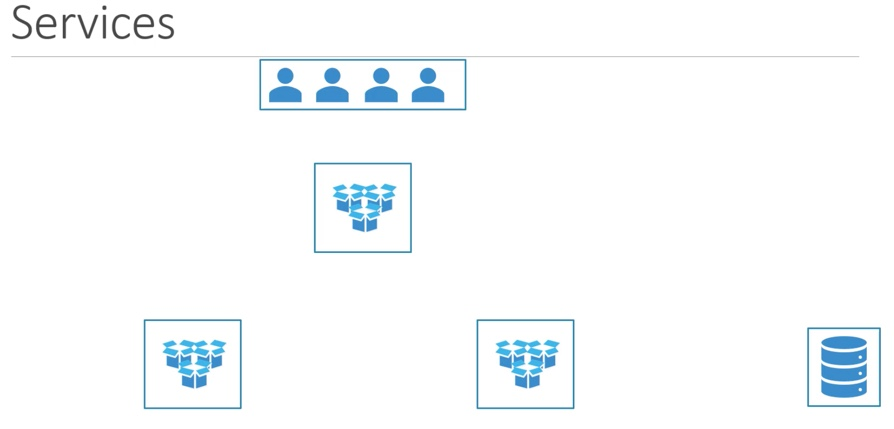
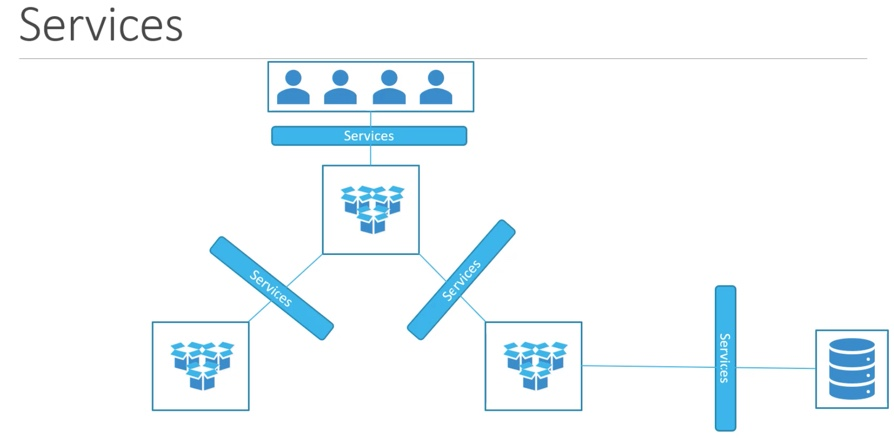
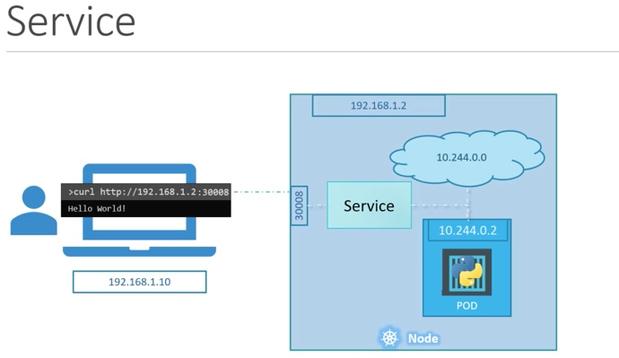
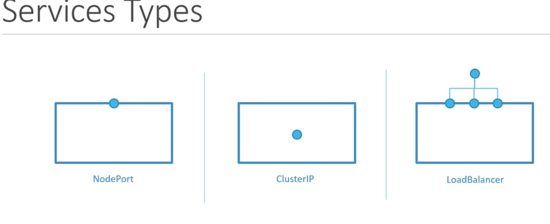
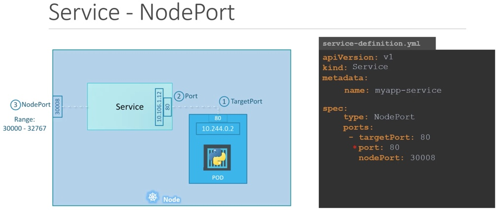
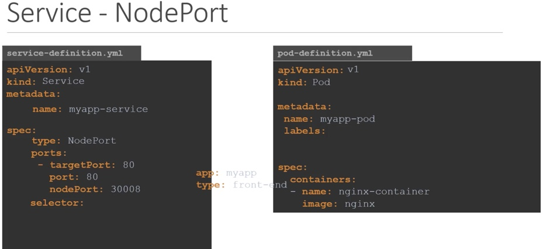
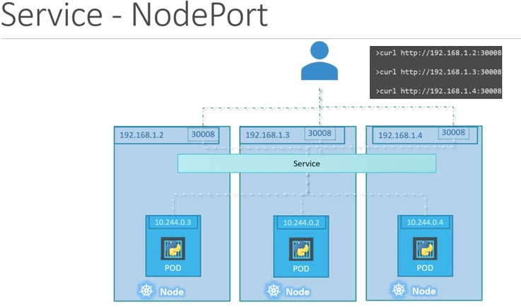
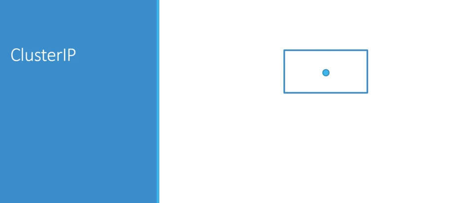
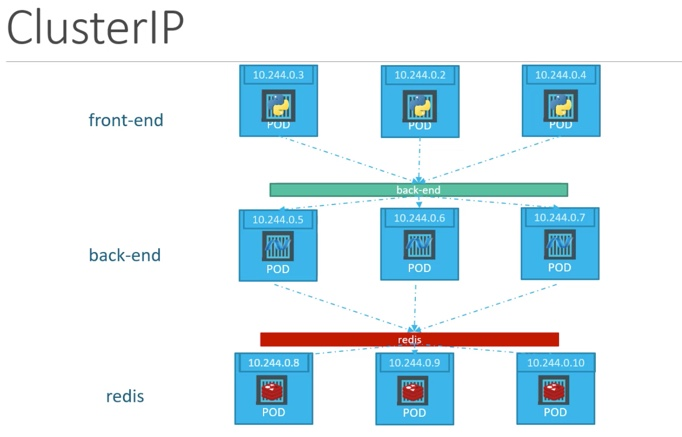
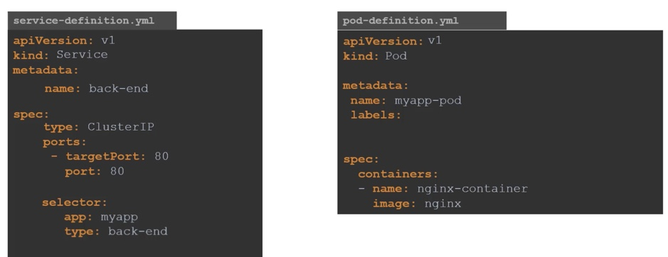

# Services & Networking



- K8s Services enable communication between various components within and outside of the application.
- K8s services helps us connect applications together with other applications or users.



- Let's consider the above grouping where we have services grouped as frontend, backend and databases.
- Services allow us to connect all the above groups together.

- Services enable loose coupling between microservices.



- Let's consider external communication. We deployed a POD having a web application deployed in it.
- How does an external user communicate with the POD?
- The POD has an IP address and the user's laptop also has an IP address.
- The internal IP range of 10.244.0.0.
- Clearly, the user cannot access the POD directly since they are in a separate network.
- What are the choices available?
  - SSH into the Cluster and `curl` on the IP address.
  - This is not something we want because we cannot let every user SSH into the cluster.

- Thus, we need a third component.
- Services allow us to connect a user directly to the PODs without having to SSH.



- NodePort allows external users to communicate with the PODs directly
- ClusterIP is for internal POD communication to allow PODs to talk among themselves.
- LoadBalancer allows balancing traffice among multiple PODs.













# Exercises
## Routing Traffic to Pods from Inside and Outside of a Cluster

1. Create a deployment named `myapp` that creates 2 replicas for Pods with the image `nginx`. Expose the container port 80.
2. Expose the Pods so that requests can be made against the service from inside of the cluster.
3. Create a temporary Pods using the image `busybox` and run a `wget` command against the IP of the service.
4. Change the service type so that the Pods can be reached from outside of the cluster.
5. Run a `wget` command against the service from outside of the cluster.
5. (Optional) Can you expose the Pods as a service without a deployment?

<details><summary>Show Solution</summary>
<p>

Create a deployment with 2 replicas first. You should end up with one deployment and two Pods.

```bash
$ kubectl run myapp --image=nginx --restart=Always --replicas=2 --port=80
deployment.apps/myapp created
$ kubectl get deployments,pods
NAME                          DESIRED   CURRENT   UP-TO-DATE   AVAILABLE   AGE
deployment.extensions/myapp   2         2         2            2           59s

NAME                         READY   STATUS    RESTARTS   AGE
pod/myapp-7bc568bfdd-972wg   1/1     Running   0          59s
pod/myapp-7bc568bfdd-l5nmz   1/1     Running   0          59s
```

Expose the service with the type `ClusterIP` and the target port 80.

``` bash
$ kubectl expose deploy myapp --target-port=80
service/myapp exposed
$ kubectl get services
NAME         TYPE        CLUSTER-IP      EXTERNAL-IP   PORT(S)   AGE
myapp        ClusterIP   10.108.88.208   <none>        80/TCP    15s
```

Determine the cluster IP and use it for the `wget` command.

```bash
$ kubectl run tmp --image=busybox --restart=Never -it --rm -- wget -O- 10.108.88.208:80
Connecting to 10.108.88.208:80 (10.108.88.208:80)
<!DOCTYPE html>
<html>
<head>
<title>Welcome to nginx!</title>
<style>
    body {
        width: 35em;
        margin: 0 auto;
        font-family: Tahoma, Verdana, Arial, sans-serif;
    }
</style>
</head>
<body>
<h1>Welcome to nginx!</h1>
<p>If you see this page, the nginx web server is successfully installed and
working. Further configuration is required.</p>

<p>For online documentation and support please refer to
<a href="http://nginx.org/">nginx.org</a>.<br/>
Commercial support is available at
<a href="http://nginx.com/">nginx.com</a>.</p>

<p><em>Thank you for using nginx.</em></p>
</body>
</html>
-                    100% |********************************|   612  0:00:00 ETA
pod "tmp" deleted
```

Turn the type of the service into `NodePort` to expose it outside of the cluster. Now, the service should expose a port in the 30000 range.

```bash
$ kubectl edit service myapp
...
spec:
  type: NodePort
...

kubectl get services
NAME         TYPE        CLUSTER-IP      EXTERNAL-IP   PORT(S)        AGE
myapp        NodePort    10.108.88.208   <none>        80:30441/TCP   3m
```

Run a `wget` or `curl` command against the service using port `30441`. On Docker for Windows/Mac you may have to use localhost or 127.0.0.1 (see [issue](https://github.com/docker/for-win/issues/1950)).

```bash
$ wget -O- localhost:30441
--2019-05-10 16:32:35--  http://localhost:30441/
Resolving localhost (localhost)... ::1, 127.0.0.1
Connecting to localhost (localhost)|::1|:30441... connected.
HTTP request sent, awaiting response... 200 OK
Length: 612 [text/html]
Saving to: ‘STDOUT’

-                                          0%[                                                                                   ]       0  --.-KB/s               <!DOCTYPE html>
<html>
<head>
<title>Welcome to nginx!</title>
<style>
    body {
        width: 35em;
        margin: 0 auto;
        font-family: Tahoma, Verdana, Arial, sans-serif;
    }
</style>
</head>
<body>
<h1>Welcome to nginx!</h1>
<p>If you see this page, the nginx web server is successfully installed and
working. Further configuration is required.</p>

<p>For online documentation and support please refer to
<a href="http://nginx.org/">nginx.org</a>.<br/>
Commercial support is available at
<a href="http://nginx.com/">nginx.com</a>.</p>

<p><em>Thank you for using nginx.</em></p>
</body>
</html>
-                                        100%[==================================================================================>]     612  --.-KB/s    in 0s

2019-05-10 16:32:35 (24.3 MB/s) - written to stdout [612/612]
```

</p>
</details>

## Restricting Access to and from a Pod

Let's assume we are working on an application stack that defines three different layers: a frontend, a backend and a database. Each of the layers runs in a Pod. You can find the definition in the YAML file `app-stack.yaml`. The application needs to run in the namespace `app-stack`.

```yaml
kind: Pod
apiVersion: v1
metadata:
  name: frontend
  namespace: app-stack
  labels:
    app: todo
    tier: frontend
spec:
  containers:
    - name: frontend
      image: nginx

---

kind: Pod
apiVersion: v1
metadata:
  name: backend
  namespace: app-stack
  labels:
    app: todo
    tier: backend
spec:
  containers:
    - name: backend
      image: nginx

---

kind: Pod
apiVersion: v1
metadata:
  name: database
  namespace: app-stack
  labels:
    app: todo
    tier: database
spec:
  containers:
    - name: database
      image: mysql
      env:
      - name: MYSQL_ROOT_PASSWORD
        value: example
```

1. Create the required namespace.
2. Copy the Pod definition to the file `app-stack.yaml` and create all three Pods. Notice that the namespace has already been defined in the YAML definition.
3. Create a network policy in the YAML file `app-stack-network-policy.yaml`.
4. The network policy should allow incoming traffic from the backend to the database but disallow incoming traffic from the frontend.
5. Incoming traffic to the database should only be allowed on TCP port 3306 and no other port.

<details><summary>Show Solution</summary>
<p>

Create the namespace 

```bash
$ kubectl create namespace app-stack
namespace/app-stack created

$ vim app-stack.yaml
$ kubectl create -f app-stack.yaml
pod/frontend created
pod/backend created
pod/database created

$ kubectl get pods --namespace app-stack
NAME       READY   STATUS    RESTARTS   AGE
backend    1/1     Running   0          22s
database   1/1     Running   0          22s
frontend   1/1     Running   0          22s
```

The following definition ensure that all rules are fulfilled.

```yaml
apiVersion: networking.k8s.io/v1
kind: NetworkPolicy
metadata:
  name: app-stack-network-policy
  namespace: app-stack
spec:
  podSelector:
    matchLabels:
      app: todo
      tier: database
  policyTypes:
  - Ingress
  - Egress
  ingress:
  - from:
    - podSelector:
        matchLabels:
          app: todo
          tier: backend
    ports:
    - protocol: TCP
      port: 3306
```

Create the network policy.

```bash
$ vim app-stack-network-policy.yaml
$ kubectl create -f app-stack-network-policy.yaml
$ kubectl get networkpolicy --namespace app-stack
NAME                       POD-SELECTOR             AGE
app-stack-network-policy   app=todo,tier=database   5s
```

</p>
</details>
